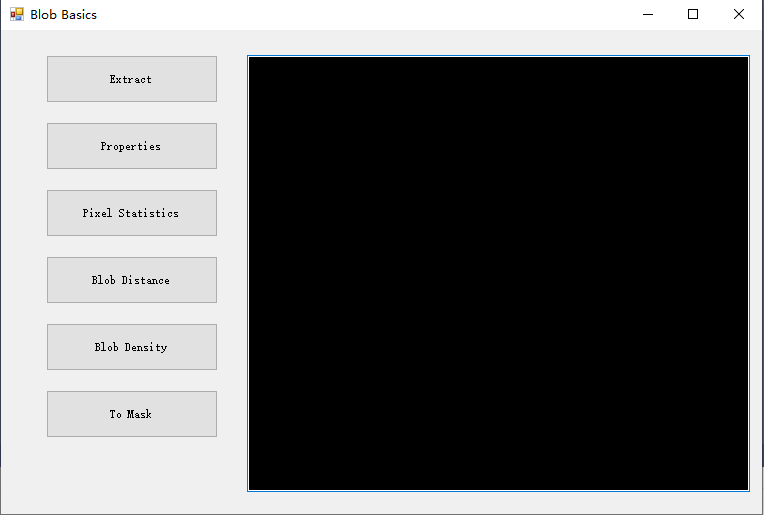

## BLOB Basic Operations

Correspond

BLOB (Binary Large Object) refers to a set of connected pixels with a value of 255 in a binary image, typically representing a foreground object. Through connected-component analysis, foreground regions that are separated from one another in a binary image can be labeled as independent BLOBs. For each BLOB, various geometric and morphological features can be computed, including position (such as centroid or bounding rectangle), area (total number of pixels), orientation (major axis angle), perimeter (boundary length), etc. These properties are commonly used for tasks such as object counting, shape recognition, size measurement, and position localization. Connectivity is usually determined by either 4-connectivity (up, down, left, right) or 8-connectivity (including diagonals), depending on the application requirements.

BLOBs can be classified into three types based on their encoding method: cluster BLOB, contour BLOB, and normal BLOB. A normal BLOB directly stores the entire BLOB region in the form of a binary image; a contour BLOB stores only the contour points of the BLOB, resulting in a smaller data size; a cluster BLOB is also represented as a point set, but unlike a contour BLOB, it contains not only the contour points but also all foreground pixel positions with a value of 255, thus fully reconstructing the original shape of the BLOB. All three types of BLOBs are extracted from binary images and are suitable for different storage and processing needs.

BLOB analysis is a traditional and simple-to-implement method for image object analysis. Its algorithm is intuitive and computationally inexpensive, so it has low hardware requirements and is suitable for running in resource-constrained environments.

## BLOB Extraction

Reading an image can be done directly by passing the file path to the KImage constructor, followed by calling Cast(PixelFormat.Gray) to convert it to a grayscale image. Binarization uses the Dip.MinError method, passing the image handle im.Handle and the mode MinErrorMode.Poinssen. This method automatically computes a threshold based on the minimum error criterion, converting the grayscale image into a binary image. Next, KBlob.ExtractRawList(im) is called to extract normally encoded BLOBs from the binary image, returning a KSequence container. If extraction succeeds, the number of BLOBs is output, and KBlob.ReleaseBlobList(seq) is called to release the resources occupied by the BLOB list, avoiding memory leaks. KSequence is used to store the collection of BLOBs. Each BLOB contains properties such as position, area, orientation, and perimeter, which can be used for subsequent analysis after extraction.

Example code:

csharp

KImage im = new KImage("..\\samples\\cell.jpg");

im.Cast(PixelFormat.Gray);

Dip.MinError(im.Handle, MinErrorMode.Poinssen);

KSequence seq = KBlob.ExtractRawList(im);

if (seq != null)

{

string str = \$"{seq.Count} blobs extracted";

tbxOutput.Text = str;

KBlob.ReleaseBlobList(seq);

}

## Displaying BLOB Properties

To extract cluster-encoded BLOBs from a binary image, use the KBlob.ExtractClusterList method. The example first loads a cell image and converts it to grayscale, then calls Dip.MinError with the Poinssen minimum error method for automatic binarization. It then extracts BLOBs and iterates through them to output geometric properties:

csharp

KImage im = new KImage("..\\samples\\cell.jpg");

im.Cast(PixelFormat.Gray);

Dip.MinError(im.Handle, MinErrorMode.Poinssen);

KSequence seq = KBlob.ExtractClusterList(im, false, 4);

if (seq != null)

{

string str = \$"{seq.Count} blobs extracted\r\n";

*// Geometric Properties*

for (int i = 0; i \< seq.Count; i++)

{

KBlob blob = new KBlob(seq.GetAt(i), true);

str += \$"The {i + 1}th blob: \r\n";

str += \$"Centroid: {blob.GetCentroid().ToString()}\r\n";

str += \$"Circular: {blob.GetCircular()}\r\n";

str += \$"Offset: {blob.GetOffset().ToString()}\r\n";

str += \$"Perimeter: {blob.GetPerimeter()}\r\n";

str += \$"Rect: {blob.GetRect().ToString()}\r\n";

str += \$"Area: {blob.GetArea()}\r\n";

str += "\r\n";

}

tbxOutput.Text = str;

KBlob.ReleaseBlobList(seq);

}

ExtractClusterList is used to extract cluster BLOBs. This type of BLOB stores all foreground pixel positions with a value of 255 as a point set, so it can fully reconstruct the object shape. The second parameter false indicates that 4-connectivity (rather than 8-connectivity) is used for BLOB segmentation, i.e., only foreground pixels adjacent up, down, left, and right are considered part of the same connected component. The third parameter 4 specifies the minimum BLOB size, meaning both the length and width of the BLOB must reach 4 elements; otherwise it is ignored, which is used to filter out excessively small noise regions. The extraction results are stored in a KSequence container, and the number of BLOBs is obtained via seq.Count.

During iteration, new KBlob(seq.GetAt(i), true) constructs a KBlob object from a sequence element. The second parameter true indicates that the BLOB handle is in the attached state, i.e., bound to the sequence. Its destructor will not release the underlying data; release work is uniformly handled by KBlob.ReleaseBlobList. The meanings of the properties are as follows:

- GetCentroid(): centroid coordinates, representing the center position of the BLOB.

- GetCircular(): circularity, reflecting how close the shape is to a circle.

- GetOffset(): position offset, usually the top-left corner coordinates of the bounding rectangle.

- GetPerimeter(): perimeter, i.e., the total length of boundary pixels.

- GetRect(): bounding rectangle, the smallest rectangle enclosing the BLOB.

- GetArea(): area, i.e., the total number of foreground pixels contained in the BLOB.

All information is concatenated and output to the tbxOutput text box. After processing, KBlob.ReleaseBlobList(seq) must be called to release the BLOB list and avoid memory leaks. Cluster BLOBs are suitable for scenarios requiring precise shapes or point-by-point processing; if only contours are needed, contour BLOBs can be used to reduce memory usage.

## Displaying Pixel Grayscale Information of the Original Image

After extracting BLOBs from a binary image, pixel statistical features can be computed for each BLOB in combination with the original grayscale image. The example first loads a cell image and converts it to grayscale, then uses Clone to save a grayscale copy imGray for subsequent statistics. Next, it calls the Poisson minimum error method to binarize the original image, then extracts cluster-encoded BLOBs via KBlob.ExtractClusterList(im, false, 4) (4-connectivity, minimum size 4). When iterating through each BLOB, passing imGray to the statistical methods obtains the statistics of the corresponding grayscale pixels within that BLOB region:

csharp

KImage im = new KImage("..\\samples\\cell.jpg");

im.Cast(PixelFormat.Gray);

KImage imGray = im.Clone();

Dip.MinError(im.Handle, MinErrorMode.Poisson);

KSequence seq = KBlob.ExtractClusterList(im, false, 4);

if (seq != null)

{

string str = \$"{seq.Count} blobs extracted\n";

*// Pixel Statistics*

for (int i = 0; i \< seq.Count; i++)

{

KBlob blob = new KBlob(seq.GetAt(i), true);

str += \$"The {i + 1}th blob: \n";

double n = blob.GetStrength(imGray);

str += \$"Strength : {n}\n";

n = blob.GetAverage(imGray);

str += \$"Average : {n}\n";

n = blob.GetVariance(imGray);

str += \$"Variance : {n}\n";

str += "\n";

}

tbxOutput.Text = str;

KBlob.ReleaseBlobList(seq);

}

im.Clone() generates an independent copy of the grayscale image. The binarization operation modifies the original image data, so cloning must be done before binarization to ensure that the original grayscale values are still accessible during statistics. GetStrength(imGray): computes the sum of grayscale values (total intensity) of all grayscale pixels within the BLOB region, reflecting the overall brightness of the object. GetAverage(imGray): computes the average value of grayscale pixels within the BLOB region, i.e., total intensity / area, reflecting the average brightness level of the object. GetVariance(imGray): computes the variance of grayscale pixels within the BLOB region, reflecting the degree of dispersion of the grayscale distribution. A larger variance indicates more pronounced internal brightness differences. All three statistics use imGray as the data source, not the binarized im; otherwise the statistical results would consist only of 0 and 255, losing practical meaning. After statistics are complete, KBlob.ReleaseBlobList(seq) must still be called to release the BLOB list resources.

## Calculating the Distance Between BLOBs

After extracting BLOBs from a binary image, the distance between any two BLOBs can be further calculated to analyze the spatial relationship between objects. The example first loads shapes.png, clones an original image imOri for later use, then converts the original image to grayscale and binarizes it using the Poinssen minimum error method. The minimum BLOB size is dynamically specified by the interface text box txbMinimumSize; after parsing, it is passed to KBlob.ExtractClusterList(im, false, msize) to extract cluster-encoded BLOBs (4-connectivity; both length and width must reach msize to be retained, otherwise ignored). When iterating over all BLOB pairs, the distance is calculated via the static KBlob.Distance method, which supports several distance metrics:

- **Default distance**: KBlob.Distance(blob1, blob2) returns the Euclidean distance between the centroids of the two BLOBs.

- **Bounding rectangle center distance**: passing BlobDistance.Rect returns the distance between the centers of the bounding rectangles of the two BLOBs.

- **Minimum rectangle center distance**: passing BlobDistance.MinBox returns the distance between the centers of the minimum bounding rectangles of the two BLOBs.

- **Contour shortest distance**: passing BlobDistance.Contour returns the shortest distance between the outermost contour points of the two BLOBs.

The code uses using statements to ensure that each KBlob object is released promptly after use. The second parameter true indicates that the handle is in the attached state and is not managed by the destructor; the underlying list is uniformly released by KBlob.ReleaseBlobList. All distance results are concatenated and output to the text box. Finally, ShowBlobInCanvas(imOri, seq) is called to draw the BLOB contours on the original image for intuitive verification.

Example code:

csharp

KImage im = new KImage("..\\samples\\shapes.png");

KImage imOri = im.Clone();

int msize = 4;

msize = int.Parse(txbMinimumSize.Text);

im.Cast(PixelFormat.Gray);

Dip.MinError(im.Handle, MinErrorMode.Poisson);

KSequence seq = KBlob.ExtractClusterList(im, false, msize);

if (seq != null)

{

string str = \$"{seq.Count} blobs extracted\n";

for (int i = 0; i \< seq.Count - 1; i++)

{

using (KBlob blob1 = new KBlob(seq.GetAt(i), true))

{

for (int j = i + 1; j \< seq.Count; j++)

{

using (KBlob blob2 = new KBlob(seq.GetAt(j), true))

{

double n = KBlob.Distance(blob1, blob2);

str += \$"The distance between the {i + 1}th blob and the {j + 1}th blob is \n{n} \n";

n = KBlob.Distance(blob1, blob2, BlobDistance.Rect);

str += \$"The bound rectangle center distance\nbetween the {i + 1}th blob and the {j + 1}th blob is \n{n} \n";

n = KBlob.Distance(blob1, blob2, BlobDistance.MinBox);

str += \$"The minimum rectangle center distance\nbetween the {i + 1}th blob and the {j + 1}th blob is \n{n} \n";

n = KBlob.Distance(blob1, blob2, BlobDistance.Contour);

str += \$"The contour distance \nbetween the {i + 1}th blob and the {j + 1}th blob is \n{n} \n";

str += "\n";

}

}

}

}

tbxOutput.Text = str;

ShowBlobInCanvas(imOri, seq);

KBlob.ReleaseBlobList(seq);

}

Note: msize is dynamically determined by the text box input, which can be used to interactively adjust the minimum BLOB size, quickly filtering noise or retaining large targets. The four distance metrics each have their own focus: centroid distance reflects overall positional differences, bounding rectangle center distance is more stable based on the bounding box, minimum rectangle center distance is sensitive to rotation, and contour distance precisely reflects the actual closest distance between the boundaries of two objects.

## Obtaining the Density of a BLOB in Different Directions

After extracting BLOBs from a binary image, the GetDensity method can be used to calculate the density of a BLOB within a specified region, i.e., the proportion of foreground elements in that region relative to the total area of the region, which is used to measure the filling degree or distribution bias of the BLOB. The example first loads shapes.png and clones an original image imOri for later use, then converts the original image to grayscale and binarizes it using the Poinssen minimum error method, followed by calling KBlob.ExtractClusterList(im, false, 4) to extract cluster-encoded BLOBs (4-connectivity, minimum size 4). When iterating through each BLOB, the density values of five regions are queried respectively:

- BlobPart.Whole: the density of the entire BLOB, i.e., the ratio of the total number of foreground elements to the area of the BLOB's bounding rectangle, reflecting the overall filling degree of the object.

- BlobPart.East: the density of the east region of the BLOB, reflecting the filling density on the right side.

- BlobPart.South: the density of the south region of the BLOB, reflecting the filling density on the bottom side.

- BlobPart.West: the density of the west region of the BLOB, reflecting the filling density on the left side.

- BlobPart.North: the density of the north region of the BLOB, reflecting the filling density on the top side.

By comparing the density differences in the four directions, the shape bias or center-of-gravity position of the BLOB can be roughly determined. All results are concatenated and output to the text box. Finally, ShowBlobInCanvas(imOri, seq) is called to draw the BLOB contours on the original image. The using statement ensures that KBlob objects are released promptly after use, and the underlying list is uniformly released by KBlob.ReleaseBlobList.

Example code:

csharp

KImage im = new KImage("..\\samples\\shapes.png");

KImage imOri = im.Clone();

im.Cast(PixelFormat.Gray);

Dip.MinError(im.Handle, MinErrorMode.Poinssen);

KSequence seq = KBlob.ExtractClusterList(im, false, 4);

if (seq != null)

{

string str = \$"{seq.Count} blobs extracted\r\n";

for (int i = 0; i \< seq.Count - 1; i++)

{

using (KBlob blob = new KBlob(seq.GetAt(i), true))

{

double n = blob.GetDensity(BlobPart.Whole);

str += \$"The while density of the {i + 1}th blob is {n} \r\n";

n = blob.GetDensity(BlobPart.East);

str += \$"The east density of the {i + 1}th blob is {n} \r\n";

n = blob.GetDensity(BlobPart.South);

str += \$"The south density of the {i + 1}th blob is {n} \r\n";

n = blob.GetDensity(BlobPart.West);

str += \$"The west density of the {i + 1}th blob is {n} \r\n";

n = blob.GetDensity(BlobPart.North);

str += \$"The north density of the {i + 1}th blob is {n} \r\n";

str += "\r\n";

}

}

tbxOutput.Text = str;

ShowBlobInCanvas(imOri, seq);

KBlob.ReleaseBlobList(seq);

}

**Note:** The density value ranges from 0 to 1. A value closer to 1 indicates that foreground elements in the region are denser, while a value closer to 0 indicates sparser. Directional density is often used for shape classification and pose estimation; for example, if the east density is significantly higher than the west density, it indicates that the BLOB's center of gravity is biased to the right.

## Deriving an Image from a BLOB

A BLOB can be constructed directly from a binary image without going through the step of extracting a list via ExtractClusterList. The example first loads triangle.png, converts it to grayscale and binarizes it using the Poinssen minimum error method, then calls KBlob.FromBinaryImageRaw(im) to treat the entire binary image as a single BLOB object, using the default encoding method (normal BLOB, stored as a binary image). Next, blob.ToMask() is called to convert the BLOB into a KMask mask object, where elements with value 1 correspond to foreground regions with pixel value 255 in the original binary image, and elements with value 0 correspond to the background. Finally, a FormMaskViewer form is created, the mask is assigned to its m_mask member, and it is displayed modally via ShowDialog for intuitive viewing of the conversion result.

Example code:

csharp

KImage im = new KImage("..\\samples\\triangle.png");

im.Cast(PixelFormat.Gray);

Dip.MinError(im.Handle, MinErrorMode.Poinssen);

KBlob blob = KBlob.FromBinaryImageRaw(im);

KMask mask = blob.ToMask();

FormMaskViewer fbV = new FormMaskViewer();

fbV.m_mask = mask;

fbV.ShowDialog();

**Key Points**

- **Difference between** FromBinaryImageRaw **and** ExtractClusterList: The former treats the entire binary image as one BLOB, suitable for scenarios where the image contains only a single foreground object; the latter separates multiple connected BLOBs from the binary image and returns a KSequence list, suitable for scenarios with multiple independent objects.

- ToMask **is the bridge between BLOBs and masks**, enabling mutual conversion between BLOBs and KMask, which facilitates using BLOB analysis results in processing pipelines that require mask input.

- The mask obtained from BLOB conversion can be directly used for subsequent operations such as image cropping, region statistics, and template matching.

- FormMaskViewer is a custom form used to visualize masks. This example only demonstrates its basic usage; the specific implementation is outside the scope of this tutorial.

