**Digital Image Processing**

Corresponding project: Process

In machine vision systems, digital image processing is usually in the pre-processing and feature extraction stage. Its core goal is not merely to change the appearance of the image, but to provide stable and quantifiable input for subsequent measurement, localization, recognition, and classification. While providing high-level algorithm interfaces, the RVB image and machine vision library also exposes low-level pixel access and modification functions, allowing developers to directly draw markers, add text, overlay contours, or temporarily modify pixel values during debugging to observe intermediate algorithm results. Such functions are very practical in development, but the formal image processing process mainly relies on standard operations such as color space conversion, binarization, convolution, pixel grayscale adjustment, and geometric transformation.

Color space conversion is used to convert between different color spaces, providing a basis for color segmentation, illumination normalization, and channel separation. Binarization compresses a grayscale image into foreground and background. Common methods include global thresholding, adaptive thresholding, and the minimum error method. Its result directly serves as input for BLOB analysis, morphological processing, and contour extraction. Pixel convolution performs denoising, sharpening, edge detection, and feature enhancement through neighborhood weighting. Typical operators include mean filtering, Gaussian filtering, Sobel, Laplacian, etc. Pixel filling is mainly used for debugging during development. Geometric transformation solves problems such as image registration, rotation correction, scaling normalization, and ROI alignment, including translation, rotation, scaling, mirroring, as well as affine and perspective transformations.

These operations are usually combined into a pipeline according to application requirements, and each step revolves around the ultimate goal of "extracting useful information from the image" rather than being used in isolation. For example, in the visual positioning of industrial products, filtering and denoising may be performed first, followed by edge enhancement, geometric correction, and template matching. Functions that directly modify pixels play more of an auxiliary display and debugging role in such pipelines, helping developers quickly verify intermediate results.

Note: Unless otherwise specified, digital image processing only supports images in the four pixel formats RGB, BGRA, GRAY, and BIN. Specific functions may only support one or several of these pixel formats.

## Grayscale Image Binarization

Grayscale image binarization refers to the process of converting a 256-level grayscale image into a binary image containing only two gray levels (usually 0 and 255). Binarization is divided into manual and automatic methods: the manual method directly specifies the grayscale threshold by the user; the automatic method requires no manual threshold input and is automatically calculated by the algorithm based on image content. Common algorithms include the minimum error method, Otsu method, maximum entropy method, etc.

**1. Manual Binarization**

The example first loads the cell.jpg color image, and saves a copy of the original image imRoot via Clone for comparison display. Then Convert24To8(RgbToGray.Default) is called to convert the color image to grayscale. Next, different manual binarization functions are called for processing:

csharp

string strFile = "..\\samples\\cell.jpg";

KImage img = new KImage();

bool b = img.Load(strFile);

Pool.Assert(b);

KImage imRoot = img.Clone();

img.Convert24To8(RgbToGray.Default);

KImage imSim = img.Clone();

Dip.Simple(imSim.Handle, 130, false);

KImage imDark = img.Clone();

Dip.Dark(imDark.Handle, 130, 255, true);

KImage imLight = img.Clone();

Dip.Light(imLight.Handle, 180, 255, true);

KImage imInner = img.Clone();

Dip.Inner(imInner.Handle, (byte)tkbLower.Value, (byte)tkbUpper.Value, 255, true);

KImage imOuter = img.Clone();

Dip.Outer(imOuter.Handle, (byte)tkbLower.Value, (byte)tkbUpper.Value, 255, true);

KImage[] arr = new KImage[6] { imRoot, imSim, imDark, imLight, imInner, imOuter };

ShowImagesInCanvas(arr, 0);

**Description of Binarization Functions**

Dip.Simple(handle, threshold, invert): Simple threshold binarization. Elements with grayscale values greater than threshold are set to 255, and the rest are set to 0. In the example, the threshold is 130, and invert is false, indicating no inversion. Suitable for scenes with obvious grayscale differences between background and foreground.

Dip.Dark(handle, threshold, value, invert): Dark region extraction. Elements with grayscale values less than threshold are set to value (255 in the example), and the rest are set to 0, i.e., darker regions are highlighted. In the example, the threshold is 130, and invert is true. Commonly used to extract targets with a dark background.

Dip.Light(handle, threshold, value, invert): Bright region extraction. Elements with grayscale values greater than threshold are set to value, and the rest are set to 0, i.e., brighter regions are highlighted. In the example, the threshold is 180, and invert is true. Commonly used to extract bright targets.

Dip.Inner(handle, lower, upper, value, invert): Inner interval extraction. Elements with grayscale values between lower and upper are set to value, and the rest are set to 0. In the example, the lower and upper limits are dynamically obtained from the sliders tkbLower and tkbUpper. Suitable for scenes where the target grayscale is concentrated.

Dip.Outer(handle, lower, upper, value, invert): Outer interval extraction. Elements with grayscale values outside the range between lower and upper (i.e., less than lower or greater than upper) are set to value, and the rest are set to 0. Complementary to Dip.Inner.

After processing, the six images (original, simple threshold, dark region, bright region, inner interval, outer interval) are stored in a KImage array, and ShowImagesInCanvas(arr, 0) is called to display them side by side in the canvas control for intuitive comparison of the binarization effects of each method. Note that before each binarization step, the grayscale image must be cloned to avoid the modified data from the previous operation affecting subsequent processing.

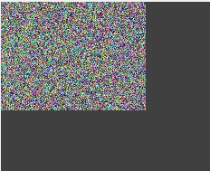

Binary images obtained by different manual binarization methods, along with the original image.

**2. Automatic Binarization**

The example first loads the cell.jpg color image and converts it to grayscale, then uses three automatic thresholding algorithms to binarize the grayscale image respectively, and finally displays the results side by side for comparison. The characteristic of automatic binarization is that no manual threshold specification is required; the algorithm calculates the optimal segmentation point based on the image grayscale distribution.

csharp

string strFile = "..\\samples\\cell.jpg";

KImage img = new KImage();

bool b = img.Load(strFile);

Pool.Assert(b);

img.Convert24To8(RgbToGray.Default);

KImage imOtsu = img.Clone();

Dip.Otsu(imOtsu.Handle, IntPtr.Zero);

KImage imEntropy = img.Clone();

Dip.MaxEntropy(imEntropy.Handle);

KImage imError = img.Clone();

Dip.MinError(imError.Handle, MinErrorMode.Gaussian);

KImage[] arr = new KImage[4] { img, imOtsu, imEntropy, imError };

ShowImagesInCanvas(arr, 0);

**Description of Automatic Thresholding Algorithms**

Dip.Otsu(handle, IntPtr.Zero): Otsu method, also known as the maximum between-class variance method. This algorithm traverses all possible thresholds, calculates the variance between the foreground and background classes, and takes the threshold that maximizes the between-class variance as the optimal segmentation point. Suitable for images with a bimodal grayscale histogram; it is fast and one of the most widely used automatic thresholding methods. The second parameter is an optional mask pointer; passing IntPtr.Zero means no mask is used, and the calculation is performed on the whole image.

Dip.MaxEntropy(handle): Maximum entropy method. Based on information theory, this algorithm treats foreground and background as two probability distributions and selects the threshold that maximizes the sum of their entropies. Suitable for images where the grayscale distributions of target and background overlap significantly and the histogram has no obvious bimodal peaks. It has certain robustness to noise.

Dip.MinError(handle, MinErrorMode.Gaussian): Minimum error method. This algorithm assumes that the grayscale distributions of foreground and background follow certain probability models (such as Gaussian or Poisson distribution) and determines the threshold by minimizing the classification error. In the example, MinErrorMode.Gaussian is passed, indicating the Gaussian model is used for fitting; MinErrorMode.Poisson (Poisson model) can also be used, which is more suitable for low-illumination or photon-counting images.

**Key Points for Use**

Before each binarization call, the grayscale image must be cloned first, because the Dip series of functions directly modify the data of the passed image. If the same instance is shared, the result of the previous algorithm will overwrite the original grayscale data, causing incorrect input for subsequent algorithms.

After processing, the original grayscale image and the three binarization results are stored in an array and displayed side by side via ShowImagesInCanvas(arr, 0), allowing intuitive comparison of the segmentation effects of different algorithms. In practical applications, Otsu is suitable for scenes with high contrast between background and target, the maximum entropy method is suitable for scenes with more overlapping grayscale distributions, and the minimum error method is more accurate when the grayscale distribution model is known.

Grayscale image and binarized binary images.

**3. Adaptive Binarization**

The example first loads the cell.jpg color image and converts it to grayscale, then calls Dip.Invert to invert the grayscale image, turning originally darker targets brighter, so that the subsequent adaptive algorithm can segment according to the bright target model. The kernel size ksz is dynamically input from the text box txbKernelSizeBin, determining the size of the local neighborhood window. Then four grayscale image copies are cloned, and Dip.Adaptive is called with different adaptive methods:

csharp

string strFile = "..\\samples\\cell.jpg";

KImage img = new KImage();

bool b = img.Load(strFile);

Pool.Assert(b);

img.Convert24To8(RgbToGray.Default);

Dip.Invert(img.Handle);

int ksz = int.Parse(txbKernelSizeBin.Text);

KImage imAda1 = img.Clone();

Dip.Adaptive(imAda1.Handle, AdaptiveBinarize.Mean, ksz, 0, 0);

KImage imAda2 = img.Clone();

Dip.Adaptive(imAda2.Handle, AdaptiveBinarize.Gaussian, ksz, 5, 0);

KImage imAda3 = img.Clone();

Dip.Adaptive(imAda3.Handle, AdaptiveBinarize.LocalInteger, ksz, 30, 0.65);

KImage imAda4 = img.Clone();

Dip.Adaptive(imAda4.Handle, AdaptiveBinarize.IsoData, ksz, 5, 0);

KImage[] arr = new KImage[5] { img, imAda1, imAda2, imAda3, imAda4 };

ShowImagesInCanvas(arr, 0);

**Dip.Adaptive Parameter Description**

The method signature is Dip.Adaptive(handle, method, kernelSize, param1, param2). The parameters are as follows:

- handle: Handle of the grayscale image to be processed.
- method: Adaptive method, specified by the AdaptiveBinarize enumeration.
- kernelSize: Kernel size of the local neighborhood window, determining the reference range when calculating the local threshold.
- param1, param2: Additional parameters of the method; their meanings differ for different methods.

**Key Points for Use**

The core idea of adaptive binarization is that each element independently calculates its threshold based on its neighborhood information, so it is effective for scenes with uneven illumination or gradual background changes that are difficult to handle with global thresholding. The choice of kernel size directly affects segmentation quality: too small a kernel makes the threshold too localized, causing holes inside the target; too large a kernel degenerates into a global threshold and loses the meaning of adaptation. Usually the kernel size should be slightly larger than the target feature size; the specific value needs to be adjusted according to image resolution and target size.

Binary images obtained by different adaptive binarization methods, along with the grayscale image.

**4. Removing Border Objects**

The example first loads cell.jpg and converts it to grayscale, then inverts it via Dip.Invert so that foreground targets appear bright. Then Dip.Otsu is called for automatic binarization to obtain the binary image imOtsu. On this basis, the code demonstrates two methods for removing connected foreground at the border, used to eliminate interference regions connected to the image edge:

csharp

string strFile = "..\\samples\\cell.jpg";

KImage img = new KImage();

bool b = img.Load(strFile);

Pool.Assert(b);

img.Convert24To8(RgbToGray.Default);

Dip.Invert(img.Handle);

KImage imOtsu = img.Clone();

Dip.Otsu(imOtsu.Handle, IntPtr.Zero);

KImage imBorder = imOtsu.Clone();

Dip.RemoveBorder(imBorder.Handle);

KImage imBorder2 = imOtsu.Clone();

KMask msk = new KMask(MaskShape.FilledEllipse, imBorder2.GetWidth(), imBorder2.GetHeight());

Dip.RemoveBorderEx(imBorder2.Handle, msk.Handle);

KImage[] arr = new KImage[3] { imOtsu, imBorder, imBorder2 };

ShowImagesInCanvas(arr, 0);

**Background Description**

After binarization, some pixels in the foreground target are often directly connected to the image border, for example, targets truncated by the image edge, background residue, or dark areas at the scanning border. Such regions are often not the true objects of interest, but they form connected components with abnormally large area and irregular shape, interfering with subsequent processing. The RemoveBorder series of functions sets foreground pixels connected to the image border to 0 (background), thereby retaining only independent foreground objects inside the image.

**Function Description**

Dip.RemoveBorder(handle): Removes foreground connected components connected to the four borders of the image. The algorithm starts from foreground pixels on the border, diffuses outward according to connectivity, and sets all pixels connected to the border to 0. In the example, imBorder is the result of this operation; it can be seen that the foreground connected into a single piece near the edge is cleared, leaving only independent regions inside the image.

Dip.RemoveBorderEx(handle, maskHandle): Border removal with a mask. The second parameter is a mask handle, used to limit the processing region. In the example, a KMask is used to create a filled ellipse mask of the same size as the image, with 1 inside and 0 outside. The algorithm only processes pixels within the valid region of the mask; pixels outside the mask remain unchanged. If the mask is understood as a "region of interest", RemoveBorderEx is equivalent to "removing foreground connected to the border only within the ROI". This version is suitable for scenarios that need to limit the processing scope and avoid mistakenly clearing external foreground.

**Key Points for Use**

RemoveBorder and RemoveBorderEx both directly modify the data of the passed image, so in the example imOtsu is cloned first to ensure the two processes do not affect each other. The shape and position of the mask directly affect the effect of RemoveBorderEx; in actual use, an appropriate mask shape and size should be selected according to the region of interest. After processing, the original binary image and the two removal results are stored in an array and displayed side by side via ShowImagesInCanvas(arr, 0) for intuitive comparison.

Binary images after border pixel removal and the original binary image.

**5. Filling Holes**

The example first loads cell.jpg and converts it to grayscale, then inverts it via Dip.Invert so that foreground targets appear bright. Then Dip.Otsu is called for automatic binarization to obtain imOtsu. On this basis, the code demonstrates two methods for filling holes in a binary image: FillHole and masked FillHoleEx.

csharp

string strFile = "..\\samples\\cell.jpg";

KImage img = new KImage();

bool b = img.Load(strFile);

Pool.Assert(b);

img.Convert24To8(RgbToGray.Default);

Dip.Invert(img.Handle);

KImage imOtsu = img.Clone();

Dip.Otsu(imOtsu.Handle, IntPtr.Zero);

KImage imHoles = imOtsu.Clone();

Dip.FillHole(imHoles.Handle);

KImage imHoles2 = imOtsu.Clone();

KMask msk = new KMask(MaskShape.FilledEllipse, imHoles2.GetWidth(), imHoles2.GetHeight());

Dip.FillHoleEx(imHoles2.Handle, msk.Handle);

KImage[] arr = new KImage[3] { imOtsu, imHoles, imHoles2 };

ShowImagesInCanvas(arr, 0);

**Background Description**

After binarization, holes may appear inside foreground objects. These holes have a pixel value of 0 (background) and are completely surrounded by foreground pixels with a value of 255. Holes usually originate from low internal brightness, uneven texture, or noise in the target. If not handled, they affect subsequent area statistics, shape analysis, and connected-component determination. The FillHole series of functions fills these internal holes surrounded by foreground with 255, making the foreground object a complete solid region.

**Function Description**

Dip.FillHole(handle): Fills all internal holes within the entire image. The algorithm starts from the image border, marks background pixels connected to the border as "external background", and the remaining background pixels not connected to the border are internal holes surrounded by foreground and are uniformly set to 255. In the example, imHoles is the result of this operation; the dark areas inside the cells are filled, and the objects become solid.

Dip.FillHoleEx(handle, maskHandle): Hole filling with a mask. The second parameter is a mask handle, used to limit the search range for filling. In the example, a KMask is used to create a filled ellipse mask of the same size as the image, with 1 inside and 0 outside. The algorithm performs hole detection and filling only within the valid region of the mask; pixels outside the mask remain unchanged. This version is suitable for scenarios that need to limit the processing range and avoid mistakenly filling external areas, for example, focusing only on targets within a circular ROI.

**Key Points for Use**

FillHole and FillHoleEx both directly modify the data of the passed image, so in the example imOtsu is cloned first to ensure the two processes do not affect each other. The determination of FillHole depends on "whether it is connected to the border", so it does not fill background regions connected to the image border; it only handles holes completely surrounded by foreground. If the foreground is not completely closed, the internal region will be connected to the external background, causing filling to fail. When using FillHoleEx, the mask boundary itself becomes the reference boundary for determining connectivity, and background outside the mask does not participate in filling. After filling, the area of the foreground object increases. If the original area needs to be accurately counted, the data should be saved before filling or the filling amount should be recorded. After processing, the original binary image and the two filling results are stored in an array and displayed side by side via ShowImagesInCanvas(arr, 0) for intuitive comparison.

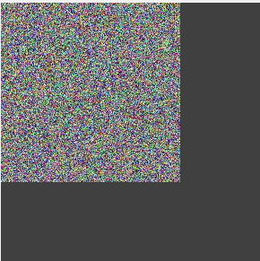

Binary images after hole filling and the original binary image.

**6. Linearization**

The example first loads cell.jpg and converts it to grayscale, then inverts it via Dip.Invert so that foreground targets appear bright, and then calls Dip.Otsu for automatic binarization to obtain imOtsu. On this basis, the code uses two methods to refine the foreground BLOBs in the binary image into single-pixel-wide linear structures:

csharp

string strFile = "..\\samples\\cell.jpg";

KImage img = new KImage();

bool b = img.Load(strFile);

Pool.Assert(b);

img.Convert24To8(RgbToGray.Default);

Dip.Invert(img.Handle);

KImage imOtsu = img.Clone();

Dip.Otsu(imOtsu.Handle, IntPtr.Zero);

KImage imSkeleton = imOtsu.Clone();

Dip.Skeleton(imSkeleton.Handle);

KImage imThin = imOtsu.Clone();

Dip.Thinning(imThin.Handle);

KImage[] arr = new KImage[3] { imOtsu, imSkeleton, imThin };

ShowImagesInCanvas(arr, 0);

**Background Description**

The foreground objects after binarization usually have a certain width and area, and it is difficult to extract the "central axis" or "topological structure" directly for shape analysis. Linearization (also called thinning or skeletonization) repeatedly strips foreground edge pixels, ultimately reducing a foreground region of arbitrary shape to a single-pixel-wide line while preserving the connectivity and topology of the original object as much as possible. Linearization results are commonly used in character recognition, blood vessel analysis, path planning, morphological measurement, and other scenarios.

**Function Description**

Dip.Skeleton(handle): Skeletonization. Based on the principle of morphological thinning, the skeleton line of the foreground object is extracted through successive erosion and conditional restoration of structuring elements. The skeleton preserves the connectivity and endpoint positions of the original object, but the degree of refinement may be affected by algorithm details. Suitable for scenarios that need to preserve the overall shape characteristics of the object.

Dip.Thinning(handle): Thinning. It also iteratively strips edge pixels, but uses a fixed thinning template to remove boundary points that meet the conditions round by round until no further changes occur. Compared with skeletonization, thinning emphasizes the topological connectivity of the object and usually produces thinner, more uniform single-pixel lines without redundant branches. Suitable for scenarios with strict connectivity requirements, such as character skeleton extraction.

**Key Points for Use**

Skeleton and Thinning both directly modify the data of the passed image, so in the example imOtsu is cloned separately to ensure the two methods do not affect each other. The effect difference between the two methods depends on the specific implementation: skeletonization may retain a small number of redundant branches or be sensitive to endpoints, while thinning results are usually more concise but may over-strip small branches. After linearization, the area of the foreground object is greatly reduced; if the original area needs to be counted, the data should be saved before processing. After processing, the original binary image and the two linearization results are stored in an array and displayed side by side via ShowImagesInCanvas(arr, 0) for intuitive comparison.

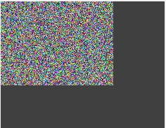

Original binary image and linearized binary images.

**7. Canny Edge**

The example first loads cell.jpg and converts it to grayscale, then calls Dip.Canny to directly extract image edges using the Canny operator, obtaining a binarized edge map.

csharp

string strFile = "..\\samples\\cell.jpg";

KImage img = new KImage();

int kernelSize = int.Parse(tbxKernelSize.Text);

bool b = img.Load(strFile);

Pool.Assert(b);

img.Convert24To8(RgbToGray.Default);

Dip.Canny(img.Handle, 50, 150, true, kernelSize);

ShowImagesInCanvas(img);

**Background Description**

The Canny operator is a classic edge detection algorithm. Unlike global or adaptive binarization, it does not segment foreground and background based on a grayscale threshold, but extracts edges by detecting regions in the image where grayscale changes sharply. Its processing flow usually includes Gaussian smoothing for denoising, calculation of gradient magnitude and direction, non-maximum suppression, dual-threshold edge determination, and edge connection. In the final output, the grayscale value of edge pixels reflects their gradient strength, and non-edge pixels are 0.

**Function Description**

Dip.Canny(handle, lowThreshold, highThreshold, bForceToBin, kernelSize) parameters are as follows:

- handle: Handle of the grayscale image to be processed.
- lowThreshold: Low threshold (50 in the example). Pixels with gradient magnitude below this value are determined as non-edges.
- highThreshold: High threshold (150 in the example). Pixels with gradient magnitude above this value are determined as strong edges and directly retained.
- bForceToBin: Boolean parameter (true in the example), indicating whether to force the result into a binary image after the Canny operation. When true, all edge pixels are uniformly set to 255, outputting a standard binary edge map; when false, the original gradient magnitude of edge pixels is retained, outputting a grayscale edge map for observing edge strength.
- kernelSize: Size of the Gaussian smoothing kernel, dynamically input from the text box txbKernelSize. This parameter determines the degree of smoothing during denoising: a larger kernel gives stronger smoothing and better noise suppression, but also blurs edges and may lose details; a smaller kernel preserves more details but is more sensitive to noise. Usually odd values such as 3, 5, and 7 are used.

The low threshold and high threshold together determine edge sensitivity: the lower the low threshold, the more edges are detected, but noise also increases; the higher the high threshold, the cleaner the edges, but weaker edges may be lost. In practical applications, the high threshold is usually 2 to 3 times the low threshold. The combination of 50 and 150 in the example is suitable for cell images with relatively obvious contrast between background and target.

**Key Points for Use**

Dip.Canny directly modifies the data of the passed image; the processing result overwrites the original image, so no prior cloning is needed. The input to the Canny operator should be a grayscale image. If the original image is color, it must first be converted with Convert24To8. The Gaussian kernel size kernelSize directly affects the balance between denoising and edge extraction: if the image has a lot of noise, the kernel can be appropriately increased; if the target details are small, the kernel should be reduced to avoid smoothing away details. After processing, ShowImagesInCanvas(img) displays the edge map, allowing intuitive observation of cell contours and internal structures. Canny edge extraction is often used as a pre-step for target segmentation, shape recognition, and feature matching.

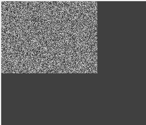

Binary image after Canny operation.

**8. Hysteresis Threshold Binarization**

The example first loads cell.jpg and converts it to grayscale, then calls Dip.Hysteresis to binarize the image using the hysteresis threshold (dual-threshold) method to extract significant edges or structures in the image.

csharp

string strFile = "..\\samples\\cell.jpg";

KImage img = new KImage();

bool b = img.Load(strFile);

Pool.Assert(b);

img.Convert24To8(RgbToGray.Default);

Dip.Hysteresis(img.Handle, (int)tkbLower.Value, (int)tkbUpper.Value, 3);

ShowImagesInCanvas(img);

**Background Description**

Hysteresis thresholding is a dual-threshold segmentation method. Its core idea is to use low and high thresholds to classify pixels: pixels with grayscale values higher than the high threshold are determined as strong targets and directly retained as foreground; pixels below the low threshold are directly set to background; pixels between the two are pending pixels, retained as foreground only if they are connected to a strong target, otherwise set to background. This connectivity strategy of "strong targets driving weak targets" can effectively suppress isolated noise while maintaining the continuity of edges or regions.

**Function Description**

Dip.Hysteresis(handle, lowThreshold, highThreshold, maxLength) parameters are as follows:

- handle: Handle of the grayscale image to be processed.
- lowThreshold: Low threshold, dynamically input from the slider tkbLower. Pixels with grayscale values below this value are directly determined as background.
- highThreshold: High threshold, dynamically input from the slider tkbUpper. Pixels with grayscale values above this value are directly determined as foreground (strong targets).
- maxLength: Maximum length (3 in the example), used to limit the maximum distance or chain length allowed when a pending pixel is connected to a strong target. The larger the value, the looser the condition for weak pixels to be included in the foreground, and the farther the connected region may extend; the smaller the value, the stricter the determination, and only pending pixels immediately adjacent to a strong target are retained.

**Difference from Canny**

Hysteresis thresholding is similar to Canny's dual-threshold determination idea, but Dip.Hysteresis is more direct: it does not perform Gaussian smoothing, gradient calculation, or non-maximum suppression, but directly uses grayscale values as the basis for determination, so it is faster and suitable for images with high contrast and less noise. Dip.Canny outputs edges in the gradient sense, while Dip.Hysteresis outputs a segmentation result closer to significant grayscale regions.

**Key Points for Use**

Dip.Hysteresis directly modifies the data of the passed image; the processing result overwrites the original image, so no prior cloning is needed. The combination of low and high thresholds directly affects the segmentation effect: too low a low threshold introduces more noise, and too high a high threshold may lose weak targets. Usually a high threshold of 2 to 3 times the low threshold is reasonable. maxLength controls the maximum span allowed when a pending pixel is connected to a strong target. If a continuous and complete result is desired, the value can be appropriately increased; if a concise and clean result is desired, a smaller value should be used. After processing, ShowImagesInCanvas(img) displays the binarization result, allowing intuitive observation of foreground structure extraction. This method is commonly used in target region segmentation, contour extraction, and pre-processing.

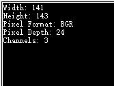

Binary image after hysteresis thresholding.

**9. Distance Transform**

The example first loads the cell.jpg image and converts it to grayscale, then inverts it via Dip.Invert so that the foreground appears bright, and then calls Dip.MaxEntropy to automatically binarize using the maximum entropy method, obtaining a binary image with foreground and background separated. On this basis, Dip.DistTransE1 is called for distance transform, the returned handle is wrapped into an image object via new KImage(h, false), and finally the binary image and the distance transform result are displayed side by side.

csharp

string strFile = "..\\samples\\cell.jpg";

KImage img = new KImage();

bool b = img.Load(strFile);

Pool.Assert(b);

img.Cast(PixelFormat.Gray);

Dip.Invert(img.Handle);

Dip.MaxEntropy(img.Handle);

IntPtr h = Dip.DistTransE1(img.Handle, (int)tkbDistance.Value);

KImage imDt = new KImage(h, false);

KImage[] arr = new KImage[2] { img, imDt };

ShowImagesInCanvas(arr, 0);

**Background Description**

The distance transform is used to calculate the distance from each foreground pixel in a binary image to the nearest background pixel, outputting a grayscale image where the grayscale value represents the distance: pixels deeper inside the foreground have larger distances (brighter), and pixels closer to the edge have smaller distances (darker). The transform result reflects the "depth" or "thickness" of each foreground point and can be used for skeleton extraction, separation of touching objects (a pre-step for the watershed algorithm), shape analysis, and removal of tiny objects.

**Function Description**

Dip.DistTransE1(handle, threshold) parameters are as follows:

- handle: Handle of the input binary image; foreground pixel values should be 255 and background 0.
- threshold: Distance threshold, dynamically input from the slider tkbDistance. This parameter is used to limit the upper limit of distance calculation or as a criterion for segmenting touching objects; the specific behavior depends on the library implementation. Usually regions with distances exceeding this value are retained or marked, and regions below this value are suppressed.

The function returns an IntPtr handle pointing to the result image of the distance transform. It is wrapped into a KImage object via new KImage(h, false); the second parameter false indicates that the KImage object takes ownership of the handle and will release the underlying data during destruction, so the handle does not need to be manually released after use.

**Role of Distance Transform**

- **Separating touching objects**: In a binary image, when multiple objects are touching, it is difficult to extract them individually. After distance transform, each object forms a brightness peak at its center, and the touching area forms a brightness valley. By thresholding these peaks, touching objects can be separated.
- **Removing tiny objects**: After distance transform, small foreground regions generally have small distance values, while larger target centers have noticeably larger distance values. By filtering out regions with small distance values through thresholding, tiny noise or irrelevant small targets can be effectively removed.
- **Skeleton extraction**: Local maxima in the distance transform map constitute candidate skeleton points of the target, from which the centerline can be extracted or shape description can be performed.
- **Shape analysis**: The distribution of distance values can reflect the width variation of the target, used to measure the thickness of tubular structures, evaluate the compactness of regions, etc.

**Key Points for Use**

The input to the distance transform must be a binary image, so in the example grayscale conversion, inversion, and maximum entropy binarization are performed first. The purpose of inversion is to ensure the foreground is 255 (bright) and the background is 0 (dark), conforming to the distance transform's determination of foreground; if the target itself is bright in the original image, the inversion step can be omitted. The threshold tkbDistance should be adjusted according to the target size: the larger the target, the higher the threshold needs to be set, otherwise valid targets may be mistakenly deleted; the smaller the target, the lower the threshold should be. After processing, ShowImagesInCanvas(arr, 0) displays the binary image and the distance transform result side by side, allowing intuitive observation of the distance distribution and touching conditions of each target. This method is commonly used in cell segmentation, particle counting, separation of touching objects, and shape analysis.

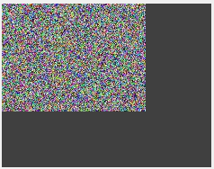

Original binary image and binary image after distance transform.

**Convolution**

Convolution is a neighborhood operation. Its core idea is to use a small matrix called a convolution kernel to slide point by point over the image, perform a weighted sum of the neighborhood pixels covered at each position and the kernel coefficients, and use the result as the pixel value at the corresponding position in the output image. The size of the convolution kernel is usually an odd-order square matrix such as 3$\times$3 or 5$\times$5, and each element in the kernel represents the weighting coefficient for different positions in the neighborhood.

Convolution is widely used in machine vision and image processing: by designing different convolution kernels, image smoothing and denoising (such as mean kernel, Gaussian kernel), edge detection (such as Sobel, Prewitt, Laplacian kernels), sharpening and feature enhancement (such as Laplacian sharpening kernel), texture analysis, and response extraction in specific directions can be achieved.

**1. Edge Sharpening**

The example first loads cell.jpg and converts it to grayscale, then uses seven different convolution kernels to sharpen or enhance the edges of the image, and finally displays the results side by side for comparison. The direction parameter is determined by the combo box cmbOrient: Horizontal, Vertical, or Both.

csharp

int idx = cmbOrient.SelectedIndex;

RvDirection direct = RvDirection.Horizontal;

if (idx == 1) direct = RvDirection.Vertical;

else if (idx == 2) direct = RvDirection.Both;

string strFile = "..\\samples\\cell.jpg";

KImage img = new KImage();

bool b = img.Load(strFile);

Pool.Assert(b);

img.Convert24To8(RgbToGray.Default);

KImage imScharr = img.Clone();

*// Enhance image edges using the Scharr filter kernel;*

Dip.Scharr(imScharr.Handle, direct);

KImage imPrewit = img.Clone();

Dip.Prewitt(imPrewit.Handle, direct);

KImage imSobel = img.Clone();

Dip.Sobel(imSobel.Handle, direct);

KImage imKirsch = img.Clone();

Dip.Kirsch(imKirsch.Handle, direct); *// Correction: changed to imKirsch.Handle*

KImage imLaPlacian = img.Clone();

Dip.LaPlacian(imLaPlacian.Handle);

KImage imRoberts = img.Clone();

Dip.Roberts(imRoberts.Handle);

KImage imS1541 = img.Clone();

Dip.Sharp1541(imS1541.Handle); *// Correction: array contains all 7 images*

KImage[] arr = new KImage[7] { imScharr, imPrewit, imSobel, imKirsch, imLaPlacian, imRoberts, imS1541 };

ShowImagesInCanvas(arr, 0);

**Direction Parameter Description**

Some operators support direction selection, specified by the RvDirection enumeration: Horizontal detects only horizontal grayscale changes, Vertical detects only vertical changes, and Both calculates both directions simultaneously and merges the results. The direction parameter usually affects the output of first-order differential operators (such as Scharr, Prewitt, Sobel); it is invalid or ignored for operators without direction distinction such as Laplacian, Roberts, and Sharp1541.

**Description of Operators**

Dip.Scharr(handle, direct): Scharr operator. A first-order differential operator used to calculate image gradients and detect edges in horizontal and vertical directions. Compared with Sobel, Scharr's kernel coefficient design makes the directionality stronger and the response to edges more precise, commonly used for edge detection with high precision requirements.

Dip.Prewitt(handle, direct): Prewitt operator. A classic first-order differential operator that approximates the gradient through neighborhood pixel differences. It has a simple structure and low computational cost, suitable for fast edge detection, but is sensitive to noise.

Dip.Sobel(handle, direct): Sobel operator. The most commonly used first-order differential operator. The kernel coefficients weight neighborhood pixels, with greater weight on the center row or column, providing a certain smoothing effect and better noise resistance than Prewitt. Commonly used for edge detection and gradient calculation.

Dip.Kirsch(handle, direct): Kirsch operator. A convolution kernel based on eight directional templates, calculating the response in each direction separately and taking the maximum value as output. It has good effect on multi-directional edge detection but requires more computation.

Dip.LaPlacian(handle): Laplacian operator. A second-order differential operator sensitive to grayscale mutations, commonly used for edge enhancement and zero-crossing detection. Because second-order differentiation is sensitive to noise, smoothing is usually applied first.

Dip.Roberts(handle): Roberts operator. A cross-difference operator based on a 2$\times$2 template, calculating gradients in the diagonal direction. It has the simplest structure and fastest speed, but weaker localization accuracy and noise resistance, suitable for scenarios with high real-time requirements.

Dip.Sharp1541(handle): Sharpening convolution kernel with coefficients such as 1, 5, 4, 1, used to enhance image details and edge contrast. Unlike differential operators, it leans more toward image sharpening rather than pure edge detection.

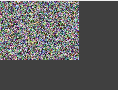

Edge enhancement effect images of different methods and the original image.

**2. Denoising or Blurring**

The example first loads cell.jpg and converts it to grayscale, then uses four blurring or denoising methods to process the image, and finally displays the results side by side. The kernel size kernelSize is dynamically input from the text box txbKernelSize.

csharp

string strFile = "..\\samples\\cell.jpg";

KImage img = new KImage();

int kernelSize = int.Parse(tbxKernelSize.Text);

bool b = img.Load(strFile);

Pool.Assert(b);

img.Convert24To8(RgbToGray.Default);

KImage imBlur = img.Clone();

Dip.Blur(imBlur.Handle, kernelSize, kernelSize);

KImage imGauss = img.Clone();

Dip.SmoothGaussian(imGauss.Handle, kernelSize, kernelSize);

KImage imMedian = img.Clone();

Dip.SmoothMedian(imMedian.Handle, kernelSize);

KImage imAvg = img.Clone();

Dip.SmoothAvg(imAvg.Handle, kernelSize);

KImage[] arr = new KImage[4] { imBlur, imGauss, imMedian, imAvg };

ShowImagesInCanvas(arr, 0);

**Background Description**

Images often introduce noise during acquisition and transmission, and excessive detail can also interfere with subsequent feature extraction. Smoothing suppresses high-frequency noise and softens edges through weighted or statistical operations on neighborhood pixels, providing more stable input for binarization, edge detection, and BLOB analysis. Different smoothing methods have different emphases in denoising ability, edge preservation, and computational efficiency.

**Function Description**

Dip.Blur(handle, width, height): General blur. Performs low-pass filtering on the image, suppressing high-frequency details and making the image softer overall. The parameters are the width and height of the kernel (both set to kernelSize in the example). Suitable for quickly softening images or removing subtle noise.

Dip.SmoothGaussian(handle, width, height): Gaussian smoothing. Uses a Gaussian kernel to weight neighborhood pixels by distance, with the largest weight at the center and smaller weights farther from the center. The smoothing result is natural and edge transitions are soft; it is one of the most commonly used denoising methods. Suitable for general noise suppression, but blurs edges to some extent.

Dip.SmoothMedian(handle, kernelSize): Median smoothing. Uses the median of all pixels in the neighborhood as output rather than a weighted average. Because the median is not affected by extreme values, this method has a significant suppression effect on salt-and-pepper noise (isolated black and white points) and preserves edge contours well. Suitable for scenarios where the noise type is impulse noise.

Dip.SmoothAvg(handle, kernelSize): Mean smoothing. Uses the arithmetic mean of pixels in the neighborhood as output. It has the simplest structure and fastest computation, but treats all neighborhood pixels equally, causing obvious edge blur and average noise resistance. Suitable for scenarios with high real-time requirements and relatively uniform noise.

**Key Points for Use**

Before calling the four methods, the grayscale image must be cloned because the Dip series of functions directly modify the passed image. The kernel size kernelSize directly affects the smoothing effect: the larger the kernel, the stronger the denoising, but the more details are lost; the smaller the kernel, the better the detail preservation, but the denoising ability is limited. Usually start with 3 or 5 and adjust according to image resolution and noise level. SmoothGaussian and Blur require the width and height of the kernel separately, allowing non-square kernel smoothing; SmoothMedian and SmoothAvg require only one kernel size parameter and use a square neighborhood by default. After processing, ShowImagesInCanvas(arr, 0) displays them side by side, allowing intuitive comparison of denoising effects and detail preservation. If subsequent edge detection or BLOB analysis is required, median smoothing is usually the first choice; if only general noise reduction is needed, Gaussian smoothing is more balanced.

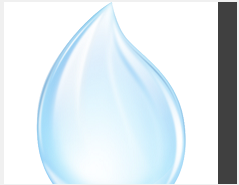

Denoising effect images of different methods and the original image.

**3. Difference Operation**

The example first loads cell.jpg and converts it to grayscale, then performs gradient operation, first-order difference, and second-order difference respectively, and finally displays the results side by side. The direction parameter is determined by the combo box cmbOrient, and the gap parameter gap is input from the text box tbxGap.

csharp

int idx = cmbOrient.SelectedIndex;

RvDirection direct = RvDirection.Horizontal;

if (idx == 1) direct = RvDirection.Vertical;

else if (idx == 2) direct = RvDirection.Both;

string strFile = "..\\samples\\cell.jpg";

KImage img = new KImage();

int gap = int.Parse(tbxGap.Text);

bool b = img.Load(strFile);

Pool.Assert(b);

img.Convert24To8(RgbToGray.Default);

KImage imgGrad = img.Clone();

Dip.Gradient(imgGrad.Handle, direct, gap);

KImage imDiff1 = img.Clone();

Dip.DiffFirst(imDiff1.Handle, direct);

KImage imDiff2 = img.Clone();

Dip.DiffSecond(imDiff2.Handle, direct);

KImage[] arr = new KImage[3] { imgGrad, imDiff1, imDiff2 };

ShowImagesInCanvas(arr, 0);

**Background Description**

Gradient and difference operations both belong to differential operations, used to detect regions in the image where grayscale changes. The more drastic the grayscale change, the stronger the differential response, so such operations are often used for edge detection, feature enhancement, and texture analysis. First-order differentiation reflects the rate of change of grayscale, and second-order differentiation reflects the change in the rate of change. The two differ in edge localization and noise sensitivity.

**Direction Parameter Description**

RvDirection is used to specify the direction of the differential operation:

- Horizontal: Calculates only horizontal grayscale changes, highlighting vertical edges.
- Vertical: Calculates only vertical grayscale changes, highlighting horizontal edges.
- Both: Calculates both directions simultaneously and merges the results to obtain edge responses in all directions.

**Function Description**

Dip.Gradient(handle, direct, gap): Gradient operation. Calculates the grayscale difference between adjacent pixels in the specified direction; gap represents the interval distance between the two pixels participating in the difference (in elements). When gap is 1, it is equivalent to adjacent pixel difference; when gap is greater than 1, the difference can be calculated across a certain distance, suitable for detecting wider edges or suppressing fine texture interference. The result of the gradient operation reflects the intensity of grayscale change; the larger the value, the more drastic the change.

Dip.DiffFirst(handle, direct): First-order difference. First-order difference produces a wider response at grayscale slopes, which can be used to detect the presence of edges, but its ability to precisely locate edge positions is weak.

Dip.DiffSecond(handle, direct): Second-order difference. Calculates the difference of the first-order difference, approximating the second derivative. Second-order difference is extremely sensitive to grayscale mutations, producing positive and negative responses on both sides of the edge; the zero-crossing point corresponds to the edge center position, so localization accuracy is higher. However, second-order difference is also more sensitive to noise, and smoothing is usually required first.

**Key Points for Use**

Before calling the three operations, the grayscale image must be cloned because the Dip series of functions directly modify the passed image. The direction parameter should be selected according to the direction of the edge to be detected: for example, cell walls are mostly vertical, so Horizontal is suitable to highlight vertical edges. The gap parameter affects the spatial scale of the gradient: smaller values are sensitive to details, while larger values emphasize macroscopic changes. In practice, start with 1 and adjust according to target size. First-order difference is suitable for scenarios where the presence of edges needs to be detected, second-order difference is suitable for scenarios requiring precise edge localization, and gradient operation provides an adjustable interval parameter between the two. After processing, ShowImagesInCanvas(arr, 0) displays them side by side, allowing intuitive comparison of the response differences of the three differential operations. If the image is noisy, it is recommended to apply Gaussian smoothing before these operations.

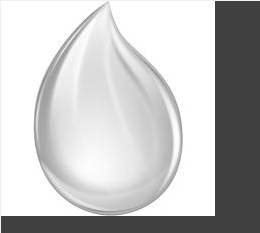

Effect of image difference calculation using different methods.

**4. Morphological Operations**

The example first loads cell.jpg and converts it to grayscale, then calls Dip.Morphology to perform morphological processing on the image according to the specified type and kernel size.

csharp

string strFile = "..\\samples\\cell.jpg";

KImage img = new KImage();

int kernelSize = int.Parse(tbxKernelSize.Text);

bool b = img.Load(strFile);

Pool.Assert(b);

img.Convert24To8(RgbToGray.Default);

Dip.Morphology(img.Handle, (MorphologyType)cmbMorphType.SelectedIndex, kernelSize);

ShowImagesInCanvas(img);

**Background Description**

Morphological processing uses structuring elements (also called kernels) as tools to change the shape and structure of targets through set operations with the image. Its core idea is to slide the kernel point by point over the image and determine the output value based on the distribution of pixels within the kernel coverage. Morphological processing can be applied to both binary and grayscale images: binary morphology is used to adjust target shape, connect breaks, separate touching objects, and remove small noise; grayscale morphology is used to extract bright/dark features, smooth backgrounds, and enhance contrast. The shape and size of the kernel directly determine the processing effect; common kernels are square, circular, or cross-shaped.

**Common Morphological Types**

- **Erode**: Takes the minimum value within the kernel coverage as output, shrinking bright regions and expanding dark regions. It can remove small bright spots and separate slightly touching targets. In grayscale images, erosion reduces overall brightness and makes bright targets smaller.
- **Dilate**: Takes the maximum value within the kernel coverage as output, expanding bright regions and shrinking dark regions. It can fill holes and connect breaks. In grayscale images, dilation increases overall brightness and makes bright targets larger.
- **Open**: Erosion followed by dilation. Removes small bright noise, breaks narrow connections, and keeps the size of the main target basically unchanged. Commonly used to smooth target contours and remove small bright spots in the background.
- **Close**: Dilation followed by erosion. Fills holes and cracks inside targets, connects adjacent regions, and keeps the main size basically unchanged. Commonly used to complete broken contours and smooth notches.
- **BlackHat**: Close operation result minus the original image, extracting details darker than the surrounding background, such as dark spots, thin gaps, and shadow areas in the background. Suitable for dark target detection.
- **TopHat**: Original image minus the open operation result, extracting details brighter than the surrounding background, such as small bright spots and fine textures in the background. Suitable for bright target detection and background correction.

**Key Points for Use**

Dip.Morphology directly modifies the data of the passed image; the processing result overwrites the original image, so no prior cloning is needed. The kernel size kernelSize is a key parameter affecting the effect: the larger the kernel, the stronger the erosion or dilation, but the more details are lost; the smaller the kernel, the gentler the processing, suitable for preserving details. Usually start with 3 and adjust gradually according to target size. The type should be selected according to the task goal: use open or erosion to remove bright spots, use close or dilation to fill holes, use top-hat to extract bright details, and use black-hat to extract dark details.

**Pixel Filling**

Pixel filling refers to the operation of modifying image pixel grayscale values at specified positions or regions. Unlike convolution, morphology, and other neighborhood- or global-based processing, pixel filling directly assigns values to target pixels without relying on neighborhood information, so it is simple and efficient. Its basic forms include: filling the entire image with a uniform value, filling a specified rectangular or arbitrary-shaped region with a uniform value, setting pixel values one by one at given coordinates, and writing an external byte array into the image buffer in batches.

Pixel filling is mainly used for debugging and observing intermediate results during development. For example, during algorithm debugging, the valid region of a mask can be marked with a specific grayscale value to visually check the range of the region of interest; the bounding rectangle, centroid, or contour points of a BLOB can be drawn on the image to verify the correctness of geometric property calculations; different grayscale values can also be used to distinguish different connected components to quickly check whether the segmentation result is reasonable. Such operations help developers observe the intermediate state of the algorithm directly on the image without relying on additional visualization tools.

Pixel filling is also a common means of constructing test data and initializing buffers. For example, in unit tests, images can be filled with known grayscale values to verify whether the output of subsequent processing functions meets expectations; during algorithm startup, Flood can be used to initialize the image to white or black as the default background; when generating masks or templates, filling operations can quickly construct regions of specific shapes.

**1. Filling Lines**

The example first loads the Earth.png color image, then calls Dip.SetPolyline to draw a polyline, and calls Dip.SetLine to draw a straight line. Both use the RGB value extracted from the background color of the color label as the drawing color.

csharp

string strFile = "..\\samples\\Earth.png";

KImage img = new KImage();

bool b = img.Load(strFile);

Pool.Assert(b);

uint color = Pool.RGB(lblFillColor.BackColor.R, lblFillColor.BackColor.G, lblFillColor.BackColor.B);

RvPoint[] vteArr = new RvPoint[5]{

new RvPoint(10, 10),

new RvPoint(200, 10),

new RvPoint(250, 200),

new RvPoint(250, 300),

new RvPoint(10, 300)

};

Dip.SetPolyline(img.Handle, vteArr, color);

Dip.SetLine(img.Handle, new RvPoint(150, 360), new RvPoint(280, 350), color);

ShowImagesInCanvas(img);

**Background Description**

In addition to assigning values by region or the entire image, pixel filling also supports drawing lines on the image according to geometric shapes. Unlike convolution and morphology, which rely on neighborhood operations, such functions directly modify the pixel values at specified coordinate positions without involving neighborhood information, so they are simple and fast to execute. Drawing polylines and straight lines is often used during debugging to mark contours, connect key points, mark paths of interest, or visualize intermediate algorithm results.

**Color Representation**

Pool.RGB(r, g, b) combines the red, green, and blue components into a 32-bit integer color value for use by drawing functions. In the example, the color is taken from the background color of the lblFillColor label, enabling a "color picker"-style interaction: the user clicks the label to change the background color, and the drawing color updates accordingly.

**Coordinate Description**

The coordinates of RvPoint use the top-left corner of the image as the origin, with x increasing to the right and y increasing downward, in pixels. The vertex coordinates in the example are all within the image size range (note the actual image width and height; if the loaded image size is smaller than 300$\times$360, the excess will not be displayed). Smath.MovePolyline(vteArr, 66, 66) is commented out; this function is used to translate all polygon vertices. Uncommenting it would move the polyline 66 pixels to the lower right.

**Key Points for Use**

Drawing functions directly modify the data of the passed image, so the result overwrites the original image; if the original image needs to be preserved, it should be cloned beforehand. Out-of-bounds coordinates will not cause an exception, but the out-of-bounds part will not be drawn. Polylines and straight lines are drawn with a single-pixel width and do not support anti-aliasing or line width parameters; if thick or smooth lines are needed, they can be drawn first and then dilated, or drawn multiple times with offset coordinates in a loop. After drawing, ShowImagesInCanvas(img) displays the result, allowing intuitive viewing of the overlay effect. Such functions are very practical in development, allowing quick verification of coordinate calculations, contour extraction, path planning, and other intermediate results, but frequent calls in high-performance production pipelines are not recommended.

**2. Filling Arcs**

**Background Description**

Ellipse drawing is used to mark circular or elliptical regions in an image, commonly used for visualizing the bounding contours of targets such as cells, holes, and particles. Similar to rectangle drawing, this operation directly modifies target pixel values without involving neighborhood operations. Supporting a rotation angle parameter allows precise matching of elliptical targets in any direction, suitable for shape analysis, fitting result verification, and debugging annotation.

**Parameter Description**

Dip.SetEllipse(handle, centerX, centerY, majorAxis, minorAxis, angle, color) parameters are as follows:

- handle: Handle of the image to be processed.
- centerX, centerY: Coordinates of the ellipse center (220, 220 in the example).
- majorAxis: Length of the major axis (160 in the example). If the minor axis is greater than the major axis, the two automatically swap roles, with the larger as the major axis.
- minorAxis: Length of the minor axis (60 in the example).
- angle: Rotation angle in degrees (45.0f in the example), representing the counterclockwise rotation angle of the ellipse major axis relative to the horizontal direction. When the angle is 0, the major axis is horizontal; when 90, the major axis is vertical.
- color: Drawing color, combined into a 32-bit integer value by Pool.RGB.

**Drawing Mode Description**

The example calls SetEllipse, which draws the ellipse contour (not filled), setting only boundary pixels to the specified color. To draw a solid ellipse, use the corresponding filled version (such as FillEllipse), which fills all pixels inside the ellipse.

**Coordinate and Size Description**

Coordinates use the top-left corner of the image as the origin, with x increasing to the right and y increasing downward. In the example, the ellipse center is at (220, 220), with a major axis of 160 and a minor axis of 60, entirely within the image range. If the ellipse partially exceeds the image boundary, the out-of-bounds part is not drawn and no exception is raised. The angle parameter is a floating-point number, supporting decimal precision, enabling precise matching in any direction.

**Key Points for Use**

Dip.SetEllipse directly modifies the data of the passed image; the result overwrites the original image. If the original image needs to be preserved, it should be cloned beforehand. The length parameters of the major and minor axes represent the full length, not the radius; for example, a major axis of 160 means the ellipse spans 160 pixels in the longest direction. The rotation angle is in degrees, with counterclockwise as the positive direction. The drawing color is interpreted differently in BGR and GRAY formats; confirm the pixel format of the target image before use. After processing, ShowImagesInCanvas(img) displays the result, allowing intuitive verification of whether the ellipse position, shape, and rotation direction meet expectations. This function is commonly used in debugging scenarios such as fitting result visualization, target annotation, and ROI definition.

**3. Filling Rectangles**

The example first loads the Earth.png color image, then calls Dip.FillRect to draw a rectangle on the image. The fill color is taken from the background color of the color label, and the drawing mode is controlled by the check box ckbFillOut.

csharp

string strFile = "..\\samples\\Earth.png";

KImage img = new KImage();

bool b = img.Load(strFile);

Pool.Assert(b);

*// Fill rectangle;*

RvRect rect;

rect.top = 30;

rect.left = 30;

rect.bottom = rect.top + 200;

rect.right = rect.left + 200;

uint color = Pool.RGB(lblFillColor.BackColor.R, lblFillColor.BackColor.G, lblFillColor.BackColor.B);

Dip.FillRect(img.Handle, rect, color, !ckbFillOut.Checked);

ShowImagesInCanvas(img);

**Background Description**

Rectangle drawing is one of the most commonly used forms of pixel filling, used to fill color or draw a border within a specified rectangular range in an image. Similar to drawing lines, this operation directly modifies target pixel values without involving neighborhood operations, so it is efficient. Rectangle drawing is often used during debugging to mark regions of interest (ROI), occlude irrelevant regions, construct test patterns, or as a quick means of generating masks.

**Parameter Description**

- handle: Handle of the image to be processed.
- rect: The rectangular region to be drawn, of type RvRect. In the example, top and left are set to 30, and bottom and right are each 200 greater than the top-left corner, so the rectangle range is (30, 30) to (230, 230), with a width and height of 200 pixels.
- color: Drawing color, combined into a 32-bit integer value by Pool.RGB. In the example, it is taken from the background color of the lblFillColor label for interactive color selection.
- bFill: Boolean parameter controlling the drawing mode. In the example, !ckbFillOut.Checked is passed: when the check box ckbFillOut is unchecked, its value is false, and after negation it is true, indicating solid filling of the entire rectangle; when checked, its value is true, and after negation it is false, indicating drawing only the rectangle border without filling the interior.

The coordinates of RvRect use the top-left corner of the image as the origin: top is the y-coordinate of the top boundary, left is the x-coordinate of the left boundary, bottom is the y-coordinate of the bottom boundary, and right is the x-coordinate of the right boundary, in pixels. The rectangle range includes boundary pixels. If the rectangle exceeds the image size, the out-of-bounds part is not drawn and no exception is raised.

**Key Points for Use**

Dip.FillRect directly modifies the data of the passed image; the result overwrites the original image. If the original image needs to be preserved, it should be cloned beforehand. Through the negation logic of !ckbFillOut.Checked, you can switch between "solid fill" and "border only": solid fill can be used to highlight ROIs or occlude the background, and border drawing can be used to mark region boundaries without affecting internal pixels. The drawing color depends on the pixel format: in BGR and GRAY formats, the return value of Pool.RGB is interpreted as grayscale or expanded by channel; confirm that the target image format matches the color value. After processing, ShowImagesInCanvas(img) displays the result, allowing intuitive verification of whether the rectangle range and color meet expectations.

**4. Filling Polygons**

The example first loads Earth.png and converts it to grayscale, then calls Dip.FillPolygonE2 to draw and fill a pentagon on the image. The drawing color is taken from the background color of the color label, and the drawing mode is controlled by the check box ckbFillOut.

csharp

string strFile = "..\\samples\\Earth.png";

KImage img = new KImage();

bool b = img.Load(strFile);

Pool.Assert(b);

img.Convert24To8(RgbToGray.Default);

uint color = Pool.RGB(lblFillColor.BackColor.R, lblFillColor.BackColor.G, lblFillColor.BackColor.B);

RvPoint[] pnVertex3 = new RvPoint[5] {

new RvPoint(0+77, 0+77), new RvPoint(200+77, 0+77), new RvPoint(250+77, 200+77), new RvPoint(250+77, 300+77), new RvPoint(0+77, 300+77)

};

Dip.FillPolygonE2(img.Handle, pnVertex3, color, ckbFillOut.Checked);

ShowImagesInCanvas(img);

**Background Description**

Polygon drawing is the most flexible form of pixel filling. By specifying any number of vertices, triangles, quadrilaterals, pentagons, and even arbitrary irregular shapes can be constructed. Unlike regular shapes such as rectangles and ellipses, polygons can accurately fit the contours of complex targets, commonly used to mark irregular regions, draw BLOB bounding polygons, visualize fitting results, or construct masks of arbitrary shapes.

**Parameter Description**

Dip.FillPolygonE2(handle, vertices, color, bFillSolid) parameters are as follows:

- handle: Handle of the image to be processed.
- vertices: Array of vertices, of type RvPoint[]. In the example, 5 vertices are defined, and each coordinate component has an offset of 77 added, so the polygon as a whole is translated 77 pixels to the lower right of the image. The vertices are connected in order, automatically closing the first and last to form a polygon.
- color: Drawing color, combined into a 32-bit integer value by Pool.RGB.
- bFillSolid: Boolean parameter controlling the drawing mode. In the example, ckbFillOut.Checked is passed: when the check box is checked, its value is true, indicating solid filling of the entire polygon; when unchecked, its value is false, indicating drawing only the polygon contour.

**Vertex Order and Closure**

The vertex array is connected in order, and the last vertex is automatically closed with the first. In the example, the vertex order is top-left → top-right → middle-right → bottom-right → bottom-left, forming a pentagon contour opening to the left. If the vertex order is chaotic (such as crossing), a self-intersecting polygon may be produced, and the filling result will be abnormal. The number of vertices must be at least 3; fewer than 3 cannot form a polygon.

**Coordinate Description**

RvPoint coordinates use the top-left corner of the image as the origin, with x increasing to the right and y increasing downward, in pixels. In the example, the vertex coordinates are offset by 77 to place the polygon in the middle of the image and avoid touching the edge. If the vertices exceed the image size, the out-of-bounds part is not drawn and no exception is raised.

**Key Points for Use**

Dip.FillPolygonE2 directly modifies the data of the passed image; the result overwrites the original image. If the original image needs to be preserved, it should be cloned beforehand. Through ckbFillOut.Checked, you can switch between "solid fill" and "contour only": solid fill is suitable for occluding regions or generating masks, and contour drawing is suitable for marking target boundaries without affecting internal pixels. In the example, the image has been converted to grayscale, so the color value of Pool.RGB is interpreted as brightness, actually appearing as fills of different grayscale levels. After processing, ShowImagesInCanvas(img) displays the result, allowing intuitive verification of whether the polygon position, shape, and fill mode meet expectations. This function is commonly used in debugging scenarios such as irregular ROI definition, BLOB contour annotation, and fitting result verification.

**5. Gradient Filling**

The example first creates a blank BGR image of width 120 and height 80, then calls Dip.FillGradient to fill the entire image with a gradient color, and finally displays the result.

csharp

KImage img = new KImage(PixelFormat.BGR, 120, 80);

RvRgb start = new RvRgb(lblFillColor.BackColor.R, lblFillColor.BackColor.G, lblFillColor.BackColor.B);

RvRgb end = new RvRgb(lblFillColor.BackColor.B, lblFillColor.BackColor.G, lblFillColor.BackColor.R);

Dip.FillGradient(img.Handle, start, end, GradientDirection.Horizontal);

ShowImagesInCanvas(img);

**Background Description**

Gradient filling is used to generate an effect of smooth transition from one color to another in an image, commonly used to construct test data, generate backgrounds, visualize color scale ranges, or for debugging display. Unlike uniform value filling, the pixel value of gradient filling is linearly interpolated between the two endpoint colors according to its position, so the result presents continuous color change.

**Parameter Description**

Dip.FillGradient(handle, startColor, endColor, direction) parameters are as follows:

- handle: Handle of the image to be filled.
- startColor: Starting color, of type RvRgb, constructed from red, green, and blue components. In the example, it is taken from the background color of the lblFillColor label, i.e., the color selected by the user.
- endColor: Ending color, also of type RvRgb. In the example, the red and blue components of the starting color are swapped to obtain a complementary color, making the color difference between the two ends of the gradient obvious and easy to observe the transition effect.
- direction: Gradient direction, specified by the GradientDirection enumeration.

**Gradient Direction**

Common values of GradientDirection include:

- Horizontal: Horizontal direction, transitioning from the left edge to the right edge of the image. The example uses this direction; the starting color is on the left and the ending color on the right.
- Vertical: Vertical direction, transitioning from the top edge to the bottom edge of the image.
- Other directions: Such as diagonal, radial, etc.; the specific values depend on the library implementation.

**Color Interpolation**

The core of gradient filling is linear interpolation: startColor is used at the starting position, endColor at the ending position, and the pixel color at intermediate positions transitions linearly between the two according to the distance ratio. In the example, the starting color is (R, G, B) and the ending color is (B, G, R). In the horizontal direction from left to right, the red component gradually decreases, the blue component gradually increases, and the green component remains unchanged, so the image presents a smooth transition from the starting color to the complementary color.

**Key Points for Use**

In the example, the image is directly created as BGR format through the constructor, without loading an external file, suitable for constructing test data. The RvRgb type is independent of the KImage pixel format and is used to describe color components; Pool.RGB returns a 32-bit integer color value. The two have different purposes: the former is used for scenarios requiring component access such as gradients, and the latter for uniform coloring scenarios such as lines and rectangles. The choice of gradient direction should be determined according to actual needs: horizontal gradient is suitable for representing horizontal changes, and vertical gradient for vertical changes.

**6. Channel Filling**

The example first loads the Earth.png color image, then fills the specified grayscale value into the selected target channel according to the combo box selection, while keeping the other channels unchanged.

csharp

string strFile = "..\\samples\\Earth.png";

KImage img = new KImage();

bool b = img.Load(strFile);

Pool.Assert(b);

Byte gray = lblFillColor.BackColor.R;

int chn = Dip.COLOR_CH1;

if (cmbChannel.SelectedIndex == 1)

{

gray = lblFillColor.BackColor.G;

chn = Dip.COLOR_CH2;

}

else if (cmbChannel.SelectedIndex == 2)

{

gray = lblFillColor.BackColor.B;

chn = Dip.COLOR_CH3;

}

Dip.FillEx(img.Handle, chn, gray);

ShowImagesInCanvas(img);

**Background Description**

In a multi-channel image, each pixel consists of multiple channel components (such as the blue, green, and red channels of a BGR image). Channel filling allows setting all pixels of a single channel to a specified value while preserving the original data of other channels. This operation is commonly used in channel separation experiments, color component replacement, pseudo-color synthesis, and observing the contribution of a single channel during debugging.

**Parameter Description**

Dip.FillEx(handle, channel, value) parameters are as follows:

- handle: Handle of the image to be processed.
- channel: Target channel identifier, specified by Dip.COLOR_CH1, Dip.COLOR_CH2, Dip.COLOR_CH3, corresponding to the first, second, and third channels of the image respectively. For a BGR image, COLOR_CH1 is the blue channel, COLOR_CH2 is the green channel, and COLOR_CH3 is the red channel; for a BGRA image, there may also be a fourth channel.
- value: Fill value, of type byte, ranging from 0 to 255. In the example, it is taken from the corresponding component of the background color of the lblFillColor label.

**Channel Selection Logic**

The example determines the fill channel and fill value through the selected index of the combo box cmbChannel:

- COLOR_CH1: the fill value is taken from the blue component of the label background color.
- COLOR_CH2: the fill value is taken from the green component of the label background color.
- COLOR_CH3: the fill value is taken from the red component of the label background color.

**Key Points for Use**

Dip.FillEx directly modifies the data of the passed image; the result overwrites the original image. If the original image needs to be preserved, it should be cloned beforehand.

**7. Flood Fill**

The example first loads the Earth.png color image, then uses the specified position as the starting point and performs flood fill according to the given color difference range, replacing the connected region similar in color to the starting point with the specified color.

csharp

string strFile = "..\\samples\\Earth.png";

KImage img = new KImage();

bool b = img.Load(strFile);

Pool.Assert(b);

RvPoint pnPos1 = new RvPoint(100,100);

RvScalarF64 lower = new RvScalarF64() { val = new double[4] };

lower.val[0] = 20.0;

lower.val[1] = 20.0;

lower.val[2] = 10;

lower.val[3] = 0.0;

RvScalarF64 upper = new RvScalarF64() { val = new double[4] };

upper.val[0] = 22.0;

upper.val[1] = 22.0;

upper.val[2] = 10;

upper.val[3] = 0.0;

RvRgb colorFill1;

colorFill1.red = lblFillColor.BackColor.R;

colorFill1.green = lblFillColor.BackColor.G;

colorFill1.blue = lblFillColor.BackColor.B;

Dip.FloodFill(img.Handle, pnPos1, colorFill1, lower, upper, 8);

ShowImagesInCanvas(img);

**Background Description**

Flood fill is a region filling algorithm that starts from a seed point and spreads outward, replacing connected pixels similar in color to the seed point with a specified color. Unlike uniform filling or rectangle filling, flood fill determines the filling range based on color similarity, so it can accurately fill regions of arbitrary shape. It is commonly used for color replacement, region annotation, matting assistance, and debugging visualization.

**Parameter Description**

Dip.FloodFill(handle, seedPoint, fillColor, lower, upper, connectivity) parameters are as follows:

- handle: Handle of the image to be processed.
- seedPoint: Seed point coordinates ((100, 100) in the example); filling starts from this position and spreads outward.
- fillColor: Fill color, of type RvRgb, composed of red, green, and blue components. In the example, it is taken from the background color of the lblFillColor label.
- lower, upper: Color similarity tolerance range, of type RvScalarF64, internally a double array of length 4, corresponding to the R, G, B, and A components in order. Each component represents the allowable deviation range from the seed point color.
- connectivity: Connectivity (8 in the example), indicating the neighborhood range considered during diffusion. 4 means 4-connectivity (up, down, left, right), and 8 means 8-connectivity (including diagonals).

**Understanding the Tolerance Range**

lower and upper define the acceptable deviation on each channel from the seed point color, not absolute color values. Taking the example: the lower bound of the red component is 20 and the upper bound is 22, meaning only pixels whose red component falls between the seed point red value +20 and +22 will be included in the fill region. This asymmetric range allows finer filtering: when the target region is slightly brighter than the background, setting both upper and lower bounds to positive values selects only the brighter region. If symmetric tolerance is needed (such as $\pm$10), set lower to -10 and upper to 10. The fourth component in the array corresponds to the Alpha channel and has no actual effect on BGR images.

**Connectivity Description**

- 4-connectivity: Only pixels adjacent in the four directions up, down, left, and right are considered connected. The fill range is relatively conservative, suitable for regions with clear boundaries.
- 8-connectivity: Additionally includes four diagonal directions. The fill range is more complete, suitable for targets with irregular shapes or jagged edges.

**Key Points for Use**

Dip.FloodFill directly modifies the data of the passed image; the result overwrites the original image. If the original image needs to be preserved, it should be cloned beforehand. The setting of the tolerance range directly affects the filling effect: too narrow a range may fill only very few pixels, and too wide a range may overflow into adjacent regions. During actual debugging, start with a smaller range, observe the filling boundary, and then gradually relax it. The choice of seed point is also critical; it should be located inside the region to be filled, and the pixel color should represent the typical color of the entire region. After processing, ShowImagesInCanvas(img) displays the result, allowing intuitive verification of whether the filling region range meets expectations. This function is commonly used in interactive matting, color replacement, region segmentation, and debugging annotation.

**8. Filling Borders**

The example first loads the waterdrop.png color image, then calls Dip.CutMargin to fill a border of specified width around the image. The fill color is taken from the background color of the color label.

csharp

string strFile = "..\\samples\\waterdrop.png";

KImage img = new KImage();

bool b = img.Load(strFile);

Pool.Assert(b);

uint color = Pool.RGB(lblFillColor.BackColor.R, lblFillColor.BackColor.G, lblFillColor.BackColor.B);

Dip.CutMargin(img.Handle, 4, color);

ShowImagesInCanvas(img);

**Background Description**

CutMargin is used to generate a margin of specified width around the image and fill that margin area with a given color. Unlike operations such as rectangle filling and flood fill that target internal image regions, this function acts on the outermost border area of the image without changing internal pixels. It is commonly used during debugging to add a visual border to the image, highlight image boundaries, or uniformly add whitespace around the image before image stitching or layout.

**Parameter Description**

Dip.CutMargin(handle, marginWidth, color) parameters are as follows:

- handle: Handle of the image to be processed.
- marginWidth: Margin width (4 in the example), in pixels. It indicates how many pixels wide to fill on each of the top, bottom, left, and right sides of the image.
- color: Fill color, combined into a 32-bit integer value by Pool.RGB. In the example, it is taken from the background color of the lblFillColor label for interactive color selection.

**Filling Effect**

After calling, a border of width 4 pixels is added around the image, with the border color being the specified color, and internal pixels remain unchanged. If the original image size is W$\times$H, the effective content area after processing is still the original image, but the periphery is surrounded by a 4-pixel-wide color band. This operation does not change the total size of the image; it only covers the edge area with the specified color.

**Key Points for Use**

Dip.CutMargin directly modifies the data of the passed image; the result overwrites the original image. If the original image needs to be preserved, it should be cloned beforehand. The margin width should be set according to image resolution and display requirements: too small may be inconspicuous, too large may obscure valid information at the edge of the original image. The fill color is interpreted differently in BGR and GRAY formats; confirm the pixel format of the target image before use. After processing, ShowImagesInCanvas(img) displays the result, allowing intuitive verification of whether the border width and color meet expectations. This function is commonly used in debugging annotation, image boundary emphasis, and layout pre-processing.

**9. Filling Text**

The example first loads the waterdrop.png color image, then calls Dip.FillTextEx to draw text at a specified position in the image. The text color, font, size, and style can all be dynamically specified through interface controls.

csharp

string strFile = "..\\samples\\waterdrop.png";

KImage img = new KImage();

bool b = img.Load(strFile);

Pool.Assert(b);

string str = "This is Kingpool world";

uint foreColor = Pool.RGB(lblTextColor.BackColor.R, lblTextColor.BackColor.G, lblTextColor.BackColor.B);

uint backColor = Pool.RGB(lblFillColor.BackColor.R, lblFillColor.BackColor.G, lblFillColor.BackColor.B);

int style = 0;

if (ckbBold.Checked) style = (int)FillTextStyle.Bold;

if (ckbItalic.Checked) style = (int)FillTextStyle.Italic;

if (ckbUnderline.Checked) style = (int)FillTextStyle.Underline;

if (ckbTransparent.Checked) style = (int)FillTextStyle.Transparent;

Dip.FillTextEx(img.Handle, str, 10, 10, "Arial", 16, foreColor, backColor, style);

ShowImagesInCanvas(img);

**Background Description**

Text filling is used to draw strings on an image, equivalent to writing text directly into image pixels as graphics. Unlike calling system drawing interfaces, this operation directly modifies pixel values in the image buffer, so the result is integrated with the image data and can participate in subsequent saving, display, and processing workflows. Text filling is particularly useful during development and debugging: it can add annotations to images, label BLOB numbers, display property information, distinguish different processing results, and generate test images with descriptions.

**Parameter Description**

Dip.FillTextEx(handle, text, x, y, fontName, fontSize, foreColor, backColor, style) parameters are as follows:

- handle: Handle of the image to be processed.
- text: The string to be drawn ("This is Kingpool world" in the example).
- x, y: Coordinates of the top-left corner of the text in the image (10, 10 in the example).
- fontName: Font name ("Arial" in the example). Ensure the font is installed on the system; otherwise a default font may be used instead.
- fontSize: Font size (16 in the example), in points.
- foreColor: Foreground color, i.e., the color of the text itself, combined into a 32-bit integer value by Pool.RGB. In the example, it is taken from the background color of the lblTextColor label.
- backColor: Background color, i.e., the color filled behind the text. In the example, it is taken from the background color of the lblFillColor label.

**Constructing Style Flags**

Styles are combined using bitwise OR (|), allowing multiple options to be enabled simultaneously:

- FillTextStyle.Bold: Bold, corresponding to the check box ckbBold.
- FillTextStyle.Italic: Italic, corresponding to the check box ckbItalic.
- FillTextStyle.Underline: Underline, corresponding to the check box ckbUnderline.
- FillTextStyle.Transparent: Transparent, corresponding to the check box ckbTransparent. When enabled, the text background is not filled with color and is directly overlaid on the original image; when not enabled, the text area is first filled with the background color before drawing the text.

Each check box, when checked, bitwise-ORs its corresponding enumeration value into the style variable, which is finally passed to the function. This approach allows multiple styles to be superimposed; for example, checking both bold and italic makes the text both bold and italic.

**Coordinate Description**

x and y use the top-left corner of the image as the origin, specifying the top-left position of the text drawing area. In the example, (10, 10) means starting to draw 10 pixels from the left and top edges of the image. If the text is long or the font size is large, it may exceed the right boundary of the image; the excess part will not be drawn. If the transparent style is enabled, the background color parameter is still passed but has no effect.

**Key Points for Use**

Dip.FillTextEx directly modifies the data of the passed image; the result overwrites the original image. If the original image needs to be preserved, it should be cloned beforehand. The font name must be a font installed on the system; for cross-platform deployment, ensure the target environment has the font available. The contrast between foreground and background colors directly affects readability: dark text on a light background or vice versa works best. The transparent style is suitable for overlaying annotations on the original image without obscuring content; the non-transparent style is suitable for generating independent text label blocks. After processing, ShowImagesInCanvas(img) displays the result, allowing intuitive verification of whether the text position, color, and style meet expectations. This function is commonly used in debugging annotation, result visualization, and image annotation.

**10. Filling Based on a Mask**

The example first creates a 240$\times$160 BGR image, fills it entirely with green using Dip.Fill, then clones a copy and replaces the pixels of a specified region in the copy with another color based on a mask, and finally displays the original and modified images side by side.

csharp

KImage img = new KImage(PixelFormat.BGR, 240, 160);

Dip.Fill(img.Handle, 10, 10, Pool.RGB((byte)0, (byte)155, (byte)0));

KImage imMask = img.Clone();

KMask msk = new KMask(MaskShape.HorizontalStrap, imMask.GetWidth(), imMask.GetHeight(), 22);

Dip.SetPixelEx(imMask.Handle, Pool.RGB((byte)255, (byte)155, (byte)123), msk.Handle, false);

KImage[] arr = new KImage[2] { img, imMask };

ShowImagesInCanvas(arr, 0);

**Background Description**

Mask-based pixel modification uses a mask as a "selection" and assigns values only to pixels within the valid region of the mask, leaving other regions unchanged. This method is more efficient and flexible than point-by-point determination or manually calculating coordinates, because the mask can be of any shape. It is commonly used for region coloring, multi-region marking, mask result visualization, and checking whether the mask range is correct during debugging.

**Parameter Description**

Dip.SetPixelEx(handle, color, maskHandle, bInvert) parameters are as follows:

- handle: Handle of the image to be processed.
- color: The color to assign.
- maskHandle: Handle of the mask.
- bInvert: Boolean parameter. false means assigning to the valid region of the mask (value 1); true means assigning to the invalid region of the mask (value 0). This parameter can quickly achieve an "inverse selection" effect without additionally calling Toggle.

**Alignment of Mask and Image**

SetPixelEx requires the mask and image to have the same size, or at least cover the region to be processed. In the example, the mask is created with the image width and height, so it is fully aligned with the image. If the mask size is smaller than the image, the function usually aligns the top-left corner of the mask coordinate system with the top-left corner of the image; pixels outside the mask range are not affected. If the mask size is larger than the image, the excess part is ignored.

**Key Points for Use**

Dip.SetPixelEx directly modifies the data of the passed image; the result overwrites the original image. If the original image needs to be preserved, it should be cloned beforehand (in the example, the copy is cloned first and then modified). The shape of the mask determines the shape of the modified region, so any region can be colored by changing the mask type (such as ellipse, polygon, or a mask converted from a BLOB). The bInvert parameter provides inverse selection capability, similar to KMask.Toggle but more convenient: the former temporarily inverts during assignment, while the latter directly modifies the mask data. The color value is interpreted differently in BGR and GRAY formats; confirm the image format before use. After processing, ShowImagesInCanvas(arr, 0) displays the original and modified results side by side, allowing intuitive comparison of whether the mask region coloring is accurate. This function is commonly used in region marking, mask visualization, multi-region coloring, and debugging verification.

**Pixel Operations**

Pixel operations refer to uniformly modifying all pixels in an image according to a specified formula or algorithm. Unlike neighborhood-based processing such as convolution and morphology, pixel operations belong to point operations: the value of each output pixel is determined only by the value of the corresponding input pixel and does not depend on surrounding pixels, so the operations are independent and can be executed in parallel, usually with high speed. Their basic forms include grayscale transformation, linear or nonlinear mapping, brightness and contrast adjustment, gamma correction, inversion, thresholding, channel operations, and arithmetic operations between two images (addition, subtraction, multiplication, division, weighted fusion), etc.

Pixel operations are commonly used for image enhancement and pre-processing: expanding the grayscale dynamic range through linear stretching to improve contrast; adjusting brightness distribution through gamma correction to adapt to display devices; generating negative effects through inversion; and achieving color correction or pseudo-color synthesis through channel addition and subtraction. Lookup tables (LUTs) are a common implementation method for pixel operations, pre-mapping input grayscale values to output values and only requiring table lookup at runtime, avoiding repeated calculations, suitable for batch processing. In multi-channel images, pixel operations can be applied uniformly to all channels or independently to only one channel, for example, adjusting only the red component to achieve a hue shift.

When using pixel operations, attention must be paid to value range control: when calculation results exceed 0–255, saturation truncation or normalization should be performed; otherwise overflow or wraparound may occur, causing abnormal pixels. In-place operations directly modify the input image; if the original image needs to be preserved, it should be cloned beforehand. Data types must also match; floating-point results should be converted back to byte type before writing to the image buffer. Pixel operations are a pre-step for many high-level algorithms. Combined with binarization, convolution, BLOB analysis, etc., they can quickly improve image quality or extract specific information without introducing neighborhood blur.

**1. Normalization**

The example first loads cell.jpg and converts it to grayscale, then uses three algorithms to normalize the image, and finally displays the results side by side. These three methods all belong to point operations, i.e., each output pixel is determined only by the corresponding input pixel, not relying on the neighborhood, but acting on global statistical information to adjust the overall grayscale distribution.

csharp

string strFile = "..\\samples\\cell.jpg";

KImage img = new KImage();

int gap = int.Parse(tbxGap.Text);

bool b = img.Load(strFile);

Pool.Assert(b);

img.Convert24To8(RgbToGray.Default);

KImage imNorm = img.Clone();

Dip.Normalize(imNorm.Handle, (float)tkbAverage.Value, (float)tkbVariance.Value);

KImage imEqual = img.Clone();

Dip.Equalize(imEqual.Handle);

KImage imExp = img.Clone();

Dip.Expand(imExp.Handle);

KImage[] arr = new KImage[3] { imNorm, imEqual, imExp };

ShowImagesInCanvas(arr, 0);

**Background Description**

Image normalization is used to adjust the grayscale distribution of an image so that it reaches the expected mean, variance, or dynamic range, facilitating subsequent processing algorithms to work under uniform input conditions. Grayscale images often have grayscale distribution shifts due to uneven illumination, exposure differences, or sensor characteristics during acquisition, and direct use for binarization or feature extraction may be unstable. Normalization can eliminate such differences and improve algorithm robustness.

**Function Description**

Dip.Normalize(handle, targetAverage, targetVariance): Normalizes according to the specified mean and variance. The algorithm calculates the current image's grayscale mean and variance, then performs a linear transformation on each pixel so that the resulting image's grayscale mean equals targetAverage and variance equals targetVariance. In the example, the two target values are dynamically input from the sliders tkbAverage and tkbVariance, convenient for interactive adjustment. Suitable for scenarios where the image needs to be adjusted to specific statistical characteristics, such as matching the brightness and contrast of a reference image.

Dip.Equalize(handle): Histogram equalization. The algorithm calculates the image's grayscale histogram, computes the cumulative distribution function, and remaps the original grayscale values accordingly, making the output image's histogram approximately uniformly distributed. The effect is overall contrast enhancement; grayscale values originally concentrated in the middle are stretched to the full range, and both dark and bright details are enhanced. Suitable for images with concentrated grayscale distribution and insufficient contrast, but it may over-enhance noise or change the original brightness relationship.

Dip.Expand(handle): Grayscale expansion (contrast stretching). The algorithm finds the minimum and maximum grayscale values in the image and linearly maps them to the full 0–255 range, with intermediate grayscales stretched proportionally. Unlike equalization, expansion only performs a linear transformation and does not change the relative shape of the grayscale distribution, so it does not introduce nonlinear distortion. Suitable for images with a narrow grayscale range that are overall too dark or too bright; it is the simplest and most direct contrast enhancement method.

**Comparison of the Three Methods**

- Normalize targets the specified mean and variance, and the output result can be precisely controlled, suitable for consistency requirements between algorithms.
- Equalize targets histogram uniformity, automatically enhancing contrast without parameters, but the result is unpredictable and may amplify noise.
- Expand targets maximizing the dynamic range, performs linear stretching, is simple to compute, and the result is controllable, but it can only improve overall contrast and cannot handle local grayscale concentration problems.

**Key Points for Use**

Before calling the three methods, the grayscale image must be cloned because the Dip series of functions directly modify the passed image. The target mean and variance of Normalize should be set according to task requirements: the mean controls overall brightness, and the variance controls contrast. Too large a value causes pixel saturation, and too small a value results in insufficient contrast. Equalize is suitable as a pre-processing step to improve the stability of subsequent binarization or edge detection, but if the image has a lot of noise, smoothing should be performed first. Expand is suitable for images with an obviously narrow grayscale range; if the image itself already covers a wide grayscale range, the effect is limited. The gap variable in the code is read from the text box but not used in the example and can be ignored or removed. After processing, ShowImagesInCanvas(arr, 0) displays them side by side, allowing intuitive comparison of the effects of the three normalization methods on the same image.

**2. Linear Processing**

The example first loads cell.jpg and converts it to grayscale, then performs linear adjustment and contrast adjustment respectively, and finally displays the results side by side. Gain and offset are input from the text boxes tbxGain and tbxOffset, and contrast parameters are controlled by the sliders tkbLowPercent and tkbUpperPercent.

csharp

string strFile = "..\\samples\\cell.jpg";

KImage img = new KImage();

int gap = int.Parse(tbxGap.Text);

bool b = img.Load(strFile);

Pool.Assert(b);

img.Convert24To8(RgbToGray.Default);

KImage imLinear = img.Clone();

Dip.Linear(imLinear.Handle, float.Parse(tbxGain.Text), float.Parse(tbxOffset.Text));

KImage imCont = img.Clone();

Dip.Contrast(imCont.Handle, (float)tkbLowPercent.Value / 100.0f, (float)tkbUpperPercent.Value / 100.0f);

KImage[] arr = new KImage[2] { imLinear, imCont };

ShowImagesInCanvas(arr, 0);

**Background Description**

Linear adjustment and contrast adjustment both belong to point operations; each output pixel is determined only by the corresponding input pixel. Linear adjustment applies a uniform transformation to grayscale through gain and offset, while contrast adjustment stretches the middle range by truncating the upper and lower ends of the grayscale distribution. Both are used to improve the overall brightness and clarity of the image, but their modes of action differ.

**Function Description**

Dip.Linear(handle, gain, offset): Linear transformation. Performs output = gain $\times$ input + offset on each pixel. gain controls contrast: greater than 1 enhances contrast, less than 1 reduces contrast; offset controls overall brightness: positive values brighten, negative values darken. In the example, the two parameters are input from the text boxes tbxGain and tbxOffset. When the calculation result exceeds 0–255, saturation truncation is usually performed to avoid overflow. This method is intuitive and controllable, suitable for quickly adjusting overall brightness and contrast.

Dip.Contrast(handle, lowPercent, highPercent): Contrast adjustment. The algorithm truncates a specified proportion of pixels from each end of the grayscale histogram and linearly stretches the remaining grayscale range to 0–255. lowPercent is the low-end truncation ratio, and highPercent is the high-end truncation ratio, ranging from 0 to 1. In the example, the percentage is input from the sliders and divided by 100. The larger the truncation ratio, the stronger the stretching and the more obvious the contrast improvement, but details in dark or bright areas are lost; when the ratio is 0, no truncation is performed, equivalent to no processing. This method automatically adapts to the actual grayscale distribution of the image without manually setting a threshold, suitable for images with weak exposure and concentrated grayscale.

**Comparison of the Two Methods**

Linear is a global linear transformation with fixed parameters; the effect depends on the values of gain and offset and is independent of image content. The same set of parameters applied to different images may produce quite different results. Contrast, on the other hand, adapts to the image's own grayscale distribution to determine the transformation range. With the same truncation ratio, different images can obtain relatively reasonable contrast improvement, but the output brightness cannot be precisely controlled. In practical applications, if precise matching of target brightness is required, first use Contrast to stretch contrast, then use Linear to fine-tune brightness.

**Suggested Parameter Values**

- Dip.Linear: Gain is usually 0.5–2.0, and offset is -100 to +100. Too large a gain causes saturation in bright areas and crushing in dark areas; too large an offset makes the whole image too white or too black. During debugging, first fix the offset at 0, adjust only the gain to observe contrast changes, and then fine-tune the offset to correct brightness.
- Dip.Contrast: Low-end and high-end truncation ratios are usually 0.01–0.05 each (i.e., 1%–5%). Although a large ratio can significantly improve contrast, it loses details at both ends and may even introduce noise. If the image itself has a uniform grayscale distribution, the truncation ratio should be small or set to 0.

**Key Points for Use**

Before calling both methods, the grayscale image must be cloned because the Dip series of functions directly modify the passed image. For Dip.Linear, note the type conversion: the string read from the text box should first be converted to float. In the example, tbxGain.Text and tbxOffset.Text must ensure valid numeric input, otherwise a format exception will be thrown. The percentage of Dip.Contrast is converted from the slider integer value divided by 100 to a decimal; the slider range is usually set to 0–50, corresponding to a truncation ratio of 0%–50%. The gap variable in the code is read from the text box but not used in the example and can be ignored or removed. After processing, ShowImagesInCanvas(arr, 0) displays them side by side, allowing intuitive comparison of the effect differences between the two adjustment methods: the Linear result depends on parameter settings, while the Contrast result adapts to the image grayscale distribution.

**3. Pixel Copying**

The example first loads the cell.jpg image, then uses three methods to copy part of the pixels from the original image to newly created target images, and finally displays the original image and the three copy results side by side.

csharp

string strFile = "..\\samples\\cell.jpg";

KImage img = new KImage();

int gap = int.Parse(tbxGap.Text);

bool b = img.Load(strFile);

Pool.Assert(b);

KImage imSub1 = new KImage(img.GetPixelFormat(), 100, 100);

Dip.CopyPixels(img.Handle, 80, 20, -1, -1, imSub1.Handle);

KImage imSub2 = new KImage(img.GetPixelFormat(), 120, 120);

KMask msk = new KMask(MaskShape.FilledEllipse, 120, 120);

Dip.CopyPixelsE2(img.Handle, imSub2.Handle, msk.Handle);

KImage imSub3 = new KImage(img.GetPixelFormat(), img.GetWidth(), img.GetHeight());

RvPointF32[] pntVertex = new RvPointF32[4] {

new RvPointF32(0, 0), new RvPointF32(200, 0), new RvPointF32(200, 250), new RvPointF32(0, 250),

};

Dip.CopyPixelsE3(img.Handle, imSub3.Handle, pntVertex);

KImage[] arr = new KImage[4] { img, imSub1, imSub2, imSub3 };

ShowImagesInCanvas(arr, 0);

**Background Description**

Pixel copying is used to transfer pixel data from a specified region of the source image to the corresponding position in the target image. It is a basic operation for image cropping, ROI extraction, mask synthesis, and multi-layer stitching. Unlike pixel filling, the copy operation preserves the original color values of the source pixels and only changes their storage location. According to the way the region is specified, it can be divided into three types: rectangular region copy, mask region copy, and polygon region copy.

**Function Description**

Dip.CopyPixels(srcHandle, srcX, srcY, width, height, dstHandle): Copy by rectangular region. Starting from the (srcX, srcY) position of the source image, copies a pixel block of the specified width and height to the target image. In the example, width and height are both -1, indicating copying from the starting point to the bottom-right corner of the source image, or automatically determining the copy range according to the target image size; the specific behavior depends on the library implementation. The target image imSub1 is 100$\times$100, and the pixel format inherits from the source image.

Dip.CopyPixelsE2(srcHandle, dstHandle, maskHandle): Copy by mask region. The second parameter is the target image handle, and the third parameter is the mask handle. The algorithm copies only the source pixels within the valid region of the mask (value 1) to the corresponding positions of the target image, and regions outside the mask retain the original values of the target image. In the example, the mask is a filled ellipse with the same size as the target image, so the copy result is an elliptical image block.

Dip.CopyPixelsE3(srcHandle, dstHandle, vertices): Copy by polygon region. The third parameter is an RvPointF32 array representing the vertices of the polygon. The algorithm copies the source pixels within the polygon range to the target image. In the example, the vertices define a 200$\times$250 rectangular region (actually a quadrilateral), and the target image imSub3 has the same size as the source image, so the copy result only has content in the top-left region.

**Comparison of the Three Methods**

- CopyPixels uses a rectangular region as the range; the parameters are simple and fast, suitable for extracting regular ROI regions.
- CopyPixelsE2 uses a mask as the range and can copy arbitrary shapes, suitable for use with existing masks or for extracting pixels from a mask region converted from a BLOB.
- CopyPixelsE3 uses a polygon as the range, defining arbitrary shapes through vertices, suitable for manually specifying irregular regions or for use with contour extraction results.

**Target Image Requirements**

All three methods require the target image to be created and its buffer allocated. The pixel format is recommended to be the same as the source image; otherwise type mismatch may occur. The size of the target image determines the copy range: if the target image is smaller than the source region, the excess is clipped; if the target image is larger than the source region, the unfilled part retains the default value at creation (usually 0). In the example, imSub1 is 100$\times$100, imSub2 is 120$\times$120, and imSub3 has the same size as the source image.

**Key Points for Use**

All three copy functions directly modify the data of the target image, and the source image is not affected. Before calling, ensure the source image is successfully loaded and the target image is correctly created. When width and height of CopyPixels are passed as -1, different library implementations may behave differently: some indicate copying to the boundary, and some indicate determining by the target image size. Consult the documentation before use. Mask and polygon vertices are based on the source image coordinate system; if the source and target image sizes are inconsistent, pay attention to coordinate alignment. The gap variable in the code is read from the text box but not used in the example and can be ignored or removed. After processing, ShowImagesInCanvas(arr, 0) displays the original image and the three copy results side by side, allowing intuitive comparison of the effect differences of different copy methods. These functions are commonly used in image cropping, ROI extraction, mask synthesis, and debugging annotation.

**4. Pixel-level Operations**

The example first loads two images, colorwave.jpg and waterdrop.png, converts them to BGR format respectively, then clones the first image as the result container, calls Dip.PixelMerge to merge the second image into the result image according to the selected pixel operation type, and finally displays the two input images and the operation result side by side.

csharp

KImage img1 = new KImage("..\\samples\\colorwave.jpg");

KImage img2 = new KImage("..\\samples\\waterdrop.png");

img1.Cast(PixelFormat.BGR);

img2.Cast(PixelFormat.BGR);

KImage imgResult = img1.Clone();

Dip.PixelMerge(img2.Handle, imgResult.Handle, (PixelOperator)cmbPixelWiseType.SelectedIndex);

KImage[] arr = new KImage[3] { img1, img2, imgResult };

ShowImagesInCanvas(arr, 0);

**Background Description**

Pixel-wise operation performs arithmetic or logical operations on pixels at corresponding positions of two images one by one, and stores the output result in the target image. Unlike convolution, morphology, and other processing based on neighborhoods or statistics, pixel-level operations do not rely on neighborhood information; the output at each position is determined only by the pixel values of the two input images at the same position, so the operation is simple, parallelizable, and fast. Common forms include addition, subtraction, multiplication, division, AND, OR, NOT, XOR, etc., used in image fusion, background elimination, difference detection, mask synthesis, and pseudo-color generation.

**Parameter Description**

Dip.PixelMerge(srcHandle, dstHandle, op) parameters are as follows:

- srcHandle: Source image handle (img2 in the example), serving as the second operand of the operation.
- dstHandle: Target image handle (imgResult in the example), which is both the first operand and the storage location of the result. The operation is performed as dst = dst op src, and the result overwrites the target image.
- op: Operation type, specified by the PixelOperator enumeration. In the example, (PixelOperator)cmbPixelWiseType.SelectedIndex casts the selected index of the combo box to the enumeration, so the order of items in the combo box must match the enumeration definition order.

**Common Operation Types**

- **Add**: dst = dst + src, the brightness of the two images is superimposed, and the result becomes brighter overall. Commonly used for image fusion or background overlay.
- **Sub**: dst = dst - src, highlights the difference region between the two images, commonly used for motion detection, background elimination, and change detection. Negative values in the result are usually truncated to 0.
- **Multiply**: dst = dst $\times$ src, can achieve a mask effect, retaining bright areas and suppressing dark areas. Commonly used for image masking and fade effects.
- **Divide**: dst = dst / src, used for normalization or illumination correction; attention must be paid to division-by-zero protection.
- **And**: Bitwise AND operation, commonly used to combine a binary mask with an image, retaining the common valid region of both.
- **Or**: Bitwise OR operation, merging the valid regions of the two images.
- **Not**: Bitwise NOT, generating a negative effect, usually applied to a single image.
- **Xor**: Bitwise XOR, highlighting regions where the two images are inconsistent.

**Size and Format Requirements**

The sizes of the two images should be as consistent as possible; if the sizes differ, the library usually aligns to the smaller one, and the excess is clipped or ignored. Pixel formats must be unified. In the example, both images are first converted to BGR format to avoid abnormal operations caused by different channel counts. The target image imgResult is created by cloning img1, which ensures consistency in size and format and also retains the original data of img1 as the first operand.

**Key Points for Use**

Dip.PixelMerge directly modifies the data of the target image; the source image img2 is not affected, but imgResult is overwritten. The operation result may exceed the 0–255 range: addition may overflow, subtraction may be negative. The library usually performs saturation truncation internally, but the specific behavior should be confirmed in the documentation. This method is commonly used in image fusion, background elimination, difference detection, and mask operations.

**5. Pixel Operations by Position**

The example first creates a 240$\times$160 BGR blank image and clones two copies, then uses Dip.SetPixel and Dip.SetPixelE1 to modify pixel colors at specified positions, and finally displays the original image and the two results side by side.

csharp

KImage img = new KImage(PixelFormat.BGR, 240, 160);

KImage imRand = img.Clone();

Random rand = new Random();

for (int i = 0; i < 100; i++)

{

for (int j = 0; j < 100; j++)

{

*// Change pixel color at specified position;*

Dip.SetPixel(imRand.Handle, 20 + j, 20 + i, Pool.RGB((byte)rand.Next(255), (byte)rand.Next(255), (byte)rand.Next(255)));

}

}

KImage imPosArr = img.Clone();

RvPoint[] pnArr = new RvPoint[10000];

int c = 0;

for (int i = 0; i < 100; i++)

{

for (int j = 0; j < 100; j++)

{

pnArr[c].x = i + 50;

pnArr[c].y = j + 50;

c++;

}

}

*// Change pixel color at specified positions;*

Dip.SetPixelE1(imPosArr.Handle, pnArr, Pool.RGB((byte)255, (byte)55, (byte)123));

KImage[] arr = new KImage[3] { img, imRand, imPosArr };

ShowImagesInCanvas(arr, 0);

**Background Description**

Point-by-point pixel assignment is the most basic form of pixel operation, used to set the pixel at a specified coordinate in the image individually to a target color. Unlike region filling (such as rectangles, ellipses, polygons), point-by-point assignment does not rely on shape description and can precisely control the position and color of each pixel, so it is the most flexible, but it also means higher call overhead. To balance flexibility and efficiency, the library provides two interfaces: single-point assignment and multi-point batch assignment.

**Function Description**

Dip.SetPixel(handle, x, y, color): Single-point assignment. Sets the pixel at coordinate (x, y) in the image to color. In the example, nested loops traverse a 100$\times$100 range, calling SetPixel once per pixel, with colors randomly generated by Random, so imRand presents a 100$\times$100 colored noise region starting at (20, 20). This method is intuitive and suitable for scenarios with a small number of pixels or where positions need to be dynamically calculated, but loop calls have high overhead.

Dip.SetPixelE1(handle, points, color): Multi-point batch assignment. The second parameter is an RvPoint array representing the set of pixel coordinates to be modified; the third parameter is the uniform target color. The algorithm traverses the array and sets the pixel at each coordinate to the specified color at once. In the example, an array pnArr containing 10000 points is first constructed, with coordinates starting from (50, 50) and spread out in row-column fashion, covering a 100$\times$100 area; then SetPixelE1 is called to uniformly fill this area with the fixed color (255, 55, 123). Compared with calling SetPixel one by one, the batch interface reduces the number of function calls and is more efficient when processing a large number of pixels.

**Coordinate Description**

RvPoint coordinates use the top-left corner of the image as the origin, with x increasing to the right and y increasing downward, in pixels. In the example, the coordinates of SetPixel are calculated by 20 + j, 20 + i, shifting the noise region to the upper-left middle of the image; the coordinates of SetPixelE1 are calculated by i + 50, j + 50, with a different offset, so the starting positions of the two regions are also different. If coordinates exceed the image size, the out-of-bounds part is not drawn and no exception is raised.

**Key Points for Use**

Both functions directly modify the data of the passed image. In the example, the original image is cloned first to ensure the two modifications do not affect each other, while preserving the blank original image for comparison display. SetPixel is suitable for precise control of a single point or a small number of points. If a large number of pixels need to be set, SetPixelE1 should be preferred to reduce loop overhead. In batch assignment, all points share the same color; if different positions require different colors, they need to be called in groups or SetPixel should be used to set them one by one. Pool.RGB is used to combine color values. In the example, rand.Next(255) generates random components from 0 to 254; note that its upper limit is 255 (exclusive). To cover the full 0–255 range, use rand.Next(256). After processing, ShowImagesInCanvas(arr, 0) displays the original image and the two results side by side, allowing intuitive comparison of the effect differences between point-by-point assignment and batch assignment. These functions are commonly used in drawing marker points, modifying pixels point by point, constructing test patterns, and debugging annotation.

**6. Pixel Inversion**

The example first creates a 240$\times$160 BGR image, fills it with a specified color using img.Flood, then clones a copy and calls Dip.Invert for inversion, and finally displays the original image and the inverted result side by side.

csharp

KImage img = new KImage(PixelFormat.BGR, 240, 160);

img.Flood(Pool.RGB(124, 0, 235));

KImage imInvert = img.Clone();

Dip.Invert(imInvert.Handle);

KImage[] arr = new KImage[2] { img, imInvert };

ShowImagesInCanvas(arr, 0);

**Background Description**

Inversion belongs to point operations, inverting the grayscale value or channel component of each pixel in the image according to I = 255 - I. The operation is performed independently pixel by pixel, does not rely on neighborhood information, so it is simple, fast, and does not introduce blur or distortion. Inversion is commonly used to generate negative effects, enhance the visualization of dark details, and highlight bright targets. For multi-channel images, inversion is performed separately for each channel, so the result is complementary in color.

**Formula Description**

I = 255 - I is the most commonly used inversion formula, suitable for images represented as 8-bit unsigned. For GRAY format images, inversion makes dark areas bright and bright areas dark, similar to a photographic negative; for BGR or BGRA format images, each channel is inverted separately, and the resulting color is the complement of the original color. For example, red (255, 0, 0) becomes cyan (0, 255, 255) after inversion, and green (0, 255, 0) becomes magenta (255, 0, 255). If the image uses floating-point or other bit depths, the inversion formula should be adjusted accordingly to the maximum value minus the current value.

**Application Scenarios**

In machine vision, inversion is commonly used to generate negatives, enhance dark details, observe bright/dark distribution, and convert bright targets on a dark background to dark targets on a bright background for easier human observation. In binary images, inversion can quickly swap foreground and background, commonly used to adjust the input polarity of subsequent processing algorithms.

**Key Points for Use**

Dip.Invert directly modifies the data of the passed image; the result overwrites the original image. If the original image needs to be preserved, it should be cloned beforehand (in the example, it is cloned first and then processed). This function has no special requirements for image format; BGR, BGRA, and GRAY can all be directly applied, and the operation is independent per channel without changing the number of channels or image size. After processing, ShowImagesInCanvas(arr, 0) displays the original image and the inversion result side by side, allowing intuitive verification of whether the color complement relationship is correct. This function is commonly used for negative generation and dark detail enhancement.

**7. Color Image Color Fusion**

The example first loads the cell.jpg color image, then uses three different gradient fusion methods to convert the color image to grayscale while enhancing edges during the conversion, and finally displays the original image and the three grayscale results side by side.

csharp

string strFile = "..\\samples\\cell.jpg";

KImage img = new KImage();

bool b = img.Load(strFile);

Pool.Assert(b);

KImage imgFuse1 = img.Clone();

Dip.FuseGradients(imgFuse1.Handle, ColorFusionType.Sallience, 0);

KImage imgFuse2 = img.Clone();

Dip.FuseGradients(imgFuse2.Handle, ColorFusionType.Voting, (float)tkbEdgeThres.Value);

KImage imgFuse3 = img.Clone();

Dip.FuseGradients(imgFuse3.Handle, ColorFusionType.Direction, (float)tkbAngleThres.Value);

When converting a color image to grayscale, conventional methods (such as Convert24To8) take a weighted average of the three channels. Although they preserve overall brightness information, they weaken grayscale differences at color boundaries. Dip.FuseGradients adopts a gradient fusion strategy: first calculates the gradients of each color channel separately, then fuses the multi-channel gradients into a single grayscale response according to specified rules, thereby highlighting edges while converting to grayscale. This method is particularly effective in scenes where the color target and color background have similar brightness but different hues, significantly enhancing color boundaries and providing clearer foreground contours for subsequent binarization, edge detection, and BLOB analysis.

**Function Description**

Dip.FuseGradients(handle, fusionType, threshold) parameters are as follows:

- handle: Handle of the color image to be processed; the processing result overwrites the original image and outputs a grayscale image.
- fusionType: Fusion method, specified by the ColorFusionType enumeration, determining how multi-channel gradients are combined.
- threshold: Threshold parameter; its meaning varies with the fusion method.

**Three Fusion Methods**

- ColorFusionType.Sallience (Salience method): Fuses the gradients of each channel based on color salience, taking the channel with the strongest gradient response as the output at that position. In the example, the threshold parameter is 0, indicating no additional threshold is used. This method has the strongest response to edges with obvious color contrast, suitable for images where the target and background differ greatly in color but are similar in brightness.
- ColorFusionType.Voting (Voting method): Votes on the gradients of each channel; edges exceeding the set vote threshold are retained, and the rest are suppressed. The second parameter threshold is the edge voting threshold, dynamically input from the slider tkbEdgeThres. The higher the threshold, the more channels must respond simultaneously to be judged as an edge, resulting in cleaner results but possibly losing weaker edges; the lower the threshold, the richer the edges but the more noise.
- ColorFusionType.Direction (Direction method): Compares the directions of gradients in each channel; when multiple channels respond in the same direction, it is judged as an edge. The second parameter threshold is the direction angle threshold (in degrees), dynamically input from the slider tkbAngleThres. The smaller the threshold, the more consistent the gradient directions of each channel are required to be, and the stricter the edge; the larger the threshold, the greater the allowed direction difference, and the looser the edge.

**Method Comparison**

- Sallience requires no parameter tuning, suitable for quickly obtaining an edge-enhanced grayscale image; the response is the most direct.
- Voting suppresses noise through a voting mechanism, suitable for color images where channel gradient directions are inconsistent, but the voting threshold needs to be adjusted.
- Direction uses the consistency of gradient directions to determine edges, suitable for images where the edge directions of each channel are highly correlated, and the angle threshold needs to be adjusted.

**Key Points for Use**

Dip.FuseGradients directly modifies the data of the passed image; the result overwrites the original image. In the example, the original image is cloned first to ensure the three methods do not affect each other, while preserving the original image for comparison display. This function requires the input to be a color image (BGR or BGRA); if the input is already a grayscale image, it is meaningless. The threshold parameter should be adjusted according to image content and the strength of the target edges: the voting threshold is usually a certain proportion of the number of channels, and the angle threshold of Direction is usually 10–45 degrees. After processing, ShowImagesInCanvas(arr, 0) displays the original image and the three results side by side, allowing intuitive comparison of the enhancement effects of different fusion methods on color boundaries and overall edges. This method is commonly used in foreground extraction of color images, edge pre-processing, and grayscale conversion.

**8. Image Cropping**

The example first loads the cell.jpg image, then calls Dip.Clip to crop a specified rectangular region from the original image, generating a new image, and finally displays the original image and the crop result side by side.

csharp

string strFile = "..\\samples\\cell.jpg";

KImage img = new KImage();

bool b = img.Load(strFile);

Pool.Assert(b);

KImage imClip = Dip.Clip(img, 50, 50, 100, 100);

KImage[] arr = new KImage[2] { img, imClip };

ShowImagesInCanvas(arr, 0);

**Background Description**

Image cropping is used to extract a specified rectangular region from the original image and generate an independent new image. Unlike functions such as CopyPixels that require pre-creating a target image and manually copying pixels, Dip.Clip directly returns the crop result, making the call more concise. Cropping is commonly used to extract regions of interest (ROI), reduce the processing range to improve performance, separate target objects, and prepare local data for subsequent analysis.

**Function Description**

Dip.Clip(image, x, y, width, height) parameters are as follows:

- image: Source image object (note that a KImage instance itself is passed here, not a handle).
- x, y: Coordinates of the top-left corner of the crop region in the source image (50, 50 in the example).
- width, height: Width and height of the crop region (both 100 in the example), in pixels.

The function returns a new KImage object with size width $\times$ height, the same pixel format as the source image, and content being the rectangular region starting at (x, y) in the source image. The source image is not affected.

**Coordinates and Boundaries**

Coordinates use the top-left corner of the source image as the origin, with x increasing to the right and y increasing downward. The crop region must be entirely within the source image range. If x + width exceeds the source image width, or y + height exceeds the source image height, an exception may be raised or truncation may occur according to the boundary; the specific behavior depends on the library implementation. Confirm that the coordinate range is valid before use. In the example, the source image size is sufficient to accommodate a 100$\times$100 region starting at (50, 50).

**Return Value and Memory**

Dip.Clip returns a newly allocated KImage object whose internal buffer is independent of the source image, so subsequent modifications to the crop result do not affect the original image. The object should be released in a timely manner after use to avoid memory accumulation.

**Key Points for Use**

Dip.Clip does not modify the source image; the crop result is only reflected in the return value, so there is no need to clone beforehand. Compared with manually creating a target image and then calling CopyPixels, Clip is more convenient and suitable for one-time region extraction; if the crop result needs to be written into an existing image or composited with other pixel data, the CopyPixels series of functions should be used. The size of the crop region directly affects the overhead of subsequent processing: the smaller the range, the faster the processing, but context information may be lost. This function is commonly used in ROI extraction, target separation, local magnification, and performance optimization.

**Geometric Transformation**

Image geometric transformation refers to changing the spatial position of pixels in an image without changing the grayscale or color values of the pixels themselves. In other words, the content of the image remains unchanged before and after the transformation, but the position of each pixel in the image coordinate system has shifted. Common geometric transformations include translation, rotation, scaling, mirroring, affine transformation, and perspective transformation.

Translation moves the entire image by a specified distance horizontally or vertically; rotation rotates the image around a center point by a given angle; scaling enlarges or reduces the image size proportionally; mirroring flips the image along a horizontal or vertical axis. Affine transformation can be regarded as a combination of translation, rotation, scaling, and shearing, keeping parallel lines parallel; perspective transformation further allows parallel lines to intersect after transformation, commonly used to correct trapezoidal distortion caused by shooting angle.

The core of geometric transformation is coordinate mapping: for each pixel position in the output image, the corresponding position in the input image is calculated inversely through the transformation formula, and then the pixel value at that position is taken. Since the calculated coordinates are usually not integers, interpolation methods are needed to determine the final pixel value, commonly including nearest-neighbor interpolation, bilinear interpolation, and bicubic interpolation. Nearest-neighbor interpolation is the fastest but may produce aliasing; bilinear interpolation has better smoothing effect and is a common compromise; bicubic interpolation has higher quality but greater computation.

Geometric transformation is fundamentally different from point operations and neighborhood operations: point operations change pixel values without changing positions, neighborhood operations calculate new values based on surrounding pixels, and geometric transformation changes positions while trying to keep pixel values unchanged (the resampling process may introduce slight changes). Regions not covered by the original image may appear in the transformed image; these regions are usually filled with a specified color, such as black or white, or handled by boundary extension strategies.

Geometric transformation is widely used in machine vision, such as image registration, rotation correction, scale normalization, ROI alignment, image stitching, and perspective correction. When using, attention must be paid to the transformation center, interpolation method, boundary filling method, and the setting of the transformed image size. These parameters directly affect the quality of the result and the accuracy of subsequent processing.

**1. Scaling Images**

The example first loads the cell.jpg image, then uses three methods to scale the image: proportional scaling, scaling by target size, and extended scaling with interpolation and filling, and finally displays the original image and the three scaling results side by side.

csharp

string strFile = "..\\samples\\cell.jpg";

KImage img = new KImage();

bool b = img.Load(strFile);

Pool.Assert(b);

KImage imScale1 = img.Clone();

Dip.Scale(imScale1.Handle, (float)tkbScale.Value / 100.0f);

KImage imScale2 = new KImage(img.GetPixelFormat(), 100, 200);

Dip.ScaleEx(img.Handle, imScale2.Handle);

KImage imScale3 = img.Clone();

Dip.ScaleE1(imScale3.Handle, (float)0.4f, Pool.RGB(253, 0, 34), PixelFilterType.Bilinear, true);

KImage[] arr = new KImage[4] { img, imScale1, imScale2, imScale3 };

ShowImagesInCanvas(arr, 0);

**Background Description**

Image scaling belongs to geometric transformation; it changes the pixel size of the image through resampling while keeping the image content and structure unchanged. Scaling is divided into proportional scaling and scaling by target size: the former specifies a scaling factor, and the output size is the original size multiplied by the factor; the latter directly specifies the width and height of the output image, and the algorithm calculates the scaling ratio. Since pixel coordinates after scaling are usually not integers, interpolation methods are needed to calculate new pixel values, commonly including nearest-neighbor interpolation, bilinear interpolation, and bicubic interpolation.

**Function Description**

Dip.Scale(handle, ratio): Proportional scaling. ratio is the scaling factor; in the example, it is obtained by dividing the value of the slider tkbScale by 100. For example, when the slider value is 50, ratio is 0.5, indicating reduction to half the original; when the value is 200, it is 2.0, indicating enlargement by two times. This function directly modifies the passed image; the image size changes accordingly after scaling, and the pixel format remains unchanged.

Dip.ScaleEx(srcHandle, dstHandle): Scaling by target size. The second parameter is the target image handle; the target image must be pre-created with a specified size. In the example, imScale2 is created as 100$\times$200 (width 100, height 200), and the pixel format inherits from the original image. The function scales the source image img to the target size and stores the result in imScale2; the source image remains unchanged. This method is suitable for scenarios requiring precise control of the output size.

Dip.ScaleE1(handle, ratio, fillColor, filterType, bKeepAspect): Extended scaling. Supports specifying the interpolation method, fill color, and whether to maintain the aspect ratio. In the example, the ratio 0.4f means reduction to 40%; fillColor is the fill color for blank areas after scaling, specified as red by Pool.RGB(253, 0, 34); filterType is PixelFilterType.Bilinear, indicating bilinear interpolation; the last parameter true indicates maintaining the aspect ratio. In this case, if the target size and original image ratio are inconsistent, the excess area is filled with the fill color.

**Interpolation Methods**

- **Nearest-neighbor interpolation**: Takes the source pixel value closest to the target coordinate; fastest, but edges may show aliasing.
- **Bilinear interpolation**: Weighted calculation based on the surrounding four pixels; smooth effect, a common compromise.
- **Bicubic interpolation**: Weighted calculation based on the surrounding sixteen pixels; highest quality, but greater computation.

In the example, ScaleE1 uses bilinear interpolation, striking a balance between speed and quality.

**Key Points for Use**

All three scaling methods change the image size. Dip.Scale and Dip.ScaleE1 directly modify the passed image, so in the example the original image is cloned first to ensure they do not affect each other; Dip.ScaleEx writes the result to a pre-created target image, and the source image remains unchanged. The scaling ratio should be set according to actual needs: when enlarging, note the blur caused by interpolation; when reducing, avoid excessive reduction causing loss of details. The fill color of ScaleE1 is only visible when the aspect ratio is maintained and the target area ratio does not match; if the ratios are consistent, no filling appears. After processing, ShowImagesInCanvas(arr, 0) displays the original image and the three results side by side, allowing intuitive comparison of the effect differences of different scaling methods. These functions are commonly used in image normalization, size adaptation, and ROI adjustment.

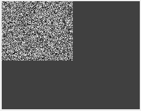

Original image and scaled images.

**2. Rotating Images**

The example first loads the waterdrop.png image, then uses three methods to rotate the image: rotation by multiples of 90 degrees, rotation by an arbitrary angle, and rotation by an arbitrary angle with a specified fill color, and finally displays the original image and the three rotation results side by side.

csharp

string strFile = "..\\samples\\waterdrop.png";

KImage img = new KImage();

bool b = img.Load(strFile);

Pool.Assert(b);

KImage imRot = img.Clone();

*// rotate with n times of 90 degrees angle*

Dip.Rotate(imRot.Handle, 1);

KImage imRot1 = img.Clone();

Dip.RotateEx(imRot1.Handle, (double)tkbAngle.Value, true, false);

KImage imRot2 = img.Clone();

Dip.RotateE2(imRot2.Handle, (double)tkbAngle.Value, Pool.RGB(255, 0, 0), true, false);

KImage[] arr = new KImage[4] { img, imRot, imRot1, imRot2 };

ShowImagesInCanvas(arr, 0);

**Background Description**

Image rotation belongs to geometric transformation; it rotates the image content around a specified center point by a given angle. The pixel values themselves do not change, but their positions in the image coordinate system shift. Rotation is commonly used in image registration, angle correction, ROI alignment, and orientation normalization. According to the representation of the rotation angle, it can be divided into rotation by multiples of 90 degrees and rotation by an arbitrary angle: the former only involves swapping row and column coordinates, requires no interpolation, is fast and lossless; the latter requires resampling and interpolation, may introduce slight blur, and the four corners of the image after rotation will have uncovered areas that need to be filled with a fill color.

**Function Description**

Dip.Rotate(handle, times): Rotation by multiples of 90 degrees. The second parameter times represents the multiple of 90 degrees; in the example, it is 1, indicating clockwise rotation by 90 degrees; 2 means 180 degrees, and 3 means 270 degrees. This method only rearranges pixel positions without interpolation, so the result is lossless. After rotation, the image width and height are swapped; for example, an original image of width 200 and height 100 becomes width 100 and height 200 after 90-degree rotation.

Dip.RotateEx(handle, angle, bResize, bKeepAspect): Rotation by an arbitrary angle. The second parameter angle is the rotation angle (in degrees), dynamically input from the slider tkbAngle. The third parameter bResize indicates whether to automatically adjust the image size to accommodate the complete rotated content; in the example, it is true, meaning the image size automatically expands after rotation to avoid content clipping. The fourth parameter bKeepAspect indicates whether to maintain the aspect ratio; in the example, it is false. Uncovered areas after rotation are filled with black by default. This function internally uses an interpolation algorithm to calculate new pixel values; when the rotation angle is not a multiple of 90 degrees, slight blur may be introduced.

Dip.RotateE2(handle, angle, fillColor, bResize, bKeepAspect): Rotation by an arbitrary angle with a fill color. Compared with RotateEx, it adds a fillColor parameter to specify the fill color for blank areas after rotation. In the example, Pool.RGB(255, 0, 0) is passed, i.e., red, so the uncovered areas at the four corners after rotation appear red, making the rotation range visually clear. The meanings of the other parameters are the same as RotateEx.

**Rotation Center**

Rotation usually uses the image center as the default rotation center. If rotation around another point is needed, the image generally needs to be translated first so that the target point aligns with the center, rotated, and then translated back. The examples all use default center rotation.

**Size Changes**

- Dip.Rotate rotates by multiples of 90 degrees; the image width and height are swapped, and the size change is deterministic.
- Dip.RotateEx and Dip.RotateE2, when bResize is true, calculate the output size according to the rotation angle to ensure the complete rotated content is preserved; if false, the output size is the same as the original image, and the part exceeding the boundary after rotation is clipped.

**Interpolation and Filling**

Arbitrary-angle rotation requires interpolation for non-integer coordinates; common methods include nearest-neighbor interpolation, bilinear interpolation, and bicubic interpolation, determined by the library's default settings or internal function parameters. Uncovered areas after rotation are filled with the fill color; the choice does not affect the rotation itself, only the display effect and the determination of blank areas in subsequent processing.

**Key Points for Use**

All three rotation functions directly modify the data of the passed image, so in the example the original image is cloned first to ensure the three rotations do not affect each other, while preserving the original image for comparison display. Dip.Rotate is suitable for scenarios requiring precise rotation by multiples of 90 degrees without interpolation errors, such as orientation correction of scanned documents. Dip.RotateEx is suitable for general angle correction; when bResize is true, content is not lost, but the output size increases; if subsequent processing has fixed size requirements, it can be set to false and edge clipping accepted. Dip.RotateE2 is suitable for debugging scenarios where the rotated region needs to be distinguished from the original content; the fill color visually shows the blank range caused by rotation. After processing, ShowImagesInCanvas(arr, 0) displays the original image and the three results side by side, allowing intuitive comparison of the effect differences of different rotation methods. These functions are commonly used in image registration, angle correction, orientation normalization, and debugging visualization.

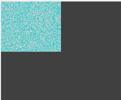

Rotation results of different rotation functions.

**3. Image Perspective Transformation**

The example first loads the waterdrop.png image and converts it to BGR format, then maps the arbitrary quadrilateral region enclosed by four specified control points on the source image to a rectangular region of the target image, generating a new image, and finally displays the original image and the transformation result side by side.

csharp

string strFile = "..\\samples\\waterdrop.png";

KImage img = new KImage();

bool b = img.Load(strFile);

Pool.Assert(b);

img.Cast(PixelFormat.BGR);

RvPointF32[] pnSrc = new RvPointF32[4] {

new RvPointF32(40, 35), new RvPointF32(289, 112), new RvPointF32(292, 273), new RvPointF32(56, 263)

};

int w = 120, h = 200;

KImage imWarp = new KImage(img.GetPixelFormat(), 120, 200);

RvPointF32[] pnDest = new RvPointF32[4] {

new RvPointF32(0, 0), new RvPointF32(w - 1, 0), new RvPointF32(w - 1, h - 1), new RvPointF32(0, h - 1)

};

Dip.Warp(img, pnSrc, imWarp);

KImage[] arr = new KImage[2] { img, imWarp };

ShowImagesInCanvas(arr, 0);

**Background Description**

Perspective transformation (Warp) is a geometric transformation that maps an image from one quadrilateral region to another quadrilateral region, belonging to a type of projective transformation. Unlike affine transformations such as translation, rotation, and scaling that preserve parallelism, perspective transformation allows parallel lines to intersect after transformation, so it can correct trapezoidal distortion caused by shooting angle and can also "straighten" an arbitrary quadrilateral region into a rectangle. Its core is to solve a 3$\times$3 transformation matrix that maps the four control points in the source image one-to-one to the four control points in the target image, and then calculate the value of each output pixel through inverse mapping and interpolation.

**Control Point Order**

The four control points must be passed in a fixed order, usually top-left, top-right, bottom-right, bottom-left, corresponding one-to-one with the target points. Incorrect order will cause the transformation result to flip or distort. The quadrilateral formed by the source control points should be a convex quadrilateral, and the order of the four points should be consistent with the target points; otherwise the transformation matrix may degenerate or produce self-intersection.

**Transformation Effect**

The example maps an irregular quadrilateral region in the source image to a 120$\times$200 rectangular output. If the source quadrilateral is a rectangular object photographed in perspective (such as a tilted sign or checkerboard), the transformation can restore it to a frontal view rectangle; if the source quadrilateral is an arbitrary shape, it is stretched or compressed into a rectangle after transformation. During the transformation, pixels outside the source quadrilateral are not copied; pixels inside the source quadrilateral are redistributed proportionally to the target rectangle.

**Interpolation and Boundaries**

Perspective transformation requires interpolation for non-integer coordinates; common methods include nearest-neighbor, bilinear, and bicubic interpolation, determined by the library implementation. If there are pixels in the target image not covered by the source region, they are usually filled with black or default values. If the source quadrilateral completely covers the target region, no unfilled pixels appear.

**Key Points for Use**

Dip.Warp does not modify the source image; the result is written to the target image, so no prior cloning is needed. The target image must be pre-created with a determined size; the function derives the target control points according to the target size. Although pnDest is not directly used in the example, it can be used for verification or subsequent extension (for example, if the function provides an overload that uses target control points). The accuracy of the control point coordinates directly determines the transformation quality: the source points should precisely correspond to the positions of the target points in the source image; deviation will cause distortion in the result. If the source quadrilateral exceeds the image range, the excess part does not participate in the mapping. After processing, ShowImagesInCanvas(arr, 0) displays the original image and the transformation result side by side, allowing intuitive verification of whether the perspective correction or shape mapping meets expectations. This method is commonly used in document scanning correction, perspective correction, ROI straightening, image stitching, and calibration.

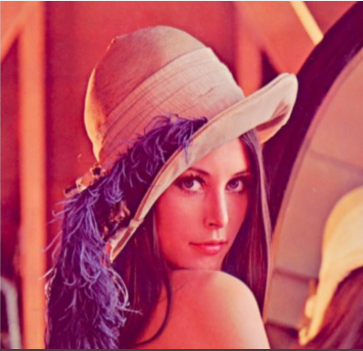

Original image and perspective transformation image.

**4. Pyramid Image**

The example first loads the waterdrop.png image and converts it to BGR format, then calls Dip.Pyramid to successively generate multiple levels of reduced images and one level of enlarged image, and finally displays the pyramid structure in the canvas in the order of "enlarged image, original image, successively reduced images".

csharp

string strFile = "..\\samples\\waterdrop.png";

KImage img = new KImage();

bool b = img.Load(strFile);

Pool.Assert(b);

img.Cast(PixelFormat.BGR);

KImage im1 = new KImage(Dip.Pyramid(img.Handle, false, IntPtr.Zero), false);

KImage im2 = new KImage(Dip.Pyramid(im1.Handle, false, IntPtr.Zero), false);

KImage im3 = new KImage(Dip.Pyramid(im2.Handle, false, IntPtr.Zero), false);

KImage im4 = new KImage(Dip.Pyramid(img.Handle, true, IntPtr.Zero), false);

KImage[] arr = new KImage[5] { im4, img, im1, im2, im3 };

ShowPyramidInCanvas(arr);

**Background Description**

An image pyramid is a multi-scale representation of the same image, generated by repeatedly downsampling or upsampling to produce a series of images of decreasing or increasing size. The width and height of each level are usually half (reduction) or twice (enlargement) of the previous level, forming a hierarchical structure from fine to coarse or coarse to fine. Image pyramids are widely used in multi-scale analysis, feature detection (such as SIFT), template matching, image fusion, and fast preview: small images are used for fast search, and large images for precise localization. Combining the two can significantly improve algorithm efficiency and robustness.

**Function Description**

Dip.Pyramid(srcHandle, bUp, dstHandle) parameters are as follows:

- srcHandle: Source image handle.
- bUp: Boolean parameter indicating whether it is an upsampling pyramid. When true, performs upsampling (enlargement), and the output image width and height are twice the source image; when false, performs downsampling (reduction), and the output image width and height are half the source image.
- dstHandle: Optional result image handle. If a valid KImage handle is passed, the function writes the result into that image; if IntPtr.Zero is passed, the function internally creates a new image and returns its handle.
- Return value: The handle of the result image. When dstHandle is IntPtr.Zero, returns the newly created image handle; when dstHandle is valid, returns that handle.

**Display Order**

Displayed in array order: arr contains im4 (enlarged), img (original), im1 (1/2), im2 (1/4), im3 (1/8) in order. This arrangement of "enlarged—original—successively reduced" intuitively presents the hierarchical structure of the image pyramid, making it easy to observe detail changes at different scales.

**Downsampling and Upsampling**

Downsampling usually first performs Gaussian smoothing on the image, then extracts pixels proportionally to avoid aliasing. After halving the size, image details are reduced, and contours are more generalized, suitable for fast search and coarse localization. Upsampling first inserts pixels and then performs smooth interpolation. After doubling the size, the image becomes blurred, and details cannot be recovered; it is only used for pyramid reconstruction or upsampling requirements. In the example, im4 is directly enlarged from the original image, so it is blurrier than the original, while im1, im2, and im3 gradually lose details.

**Key Points for Use**

Dip.Pyramid returns the handle of a new image; the source image is not affected, so no prior cloning is needed. The false in new KImage(h, false) indicates that KImage takes ownership of the handle and automatically releases it after use, avoiding memory leaks. If the pyramid result needs to be written into an existing image, the image handle can be passed as the third parameter; in this case, the function no longer creates a new image, and the return value is that handle. The number of pyramid levels should be determined according to image size and target requirements: too many levels make the smallest image too small and meaningless; too few levels cannot cover a sufficient scale range. In the example, three levels of reduction have reduced im3 to one-eighth of the original; if the original is 320$\times$240, im3 is only 40$\times$30, and further reduction would have no practical value. After processing, ShowPyramidInCanvas(arr) displays each level, allowing intuitive observation of the multi-scale structure. This function is commonly used in multi-scale feature extraction, image fusion, template matching acceleration, and image browsing.

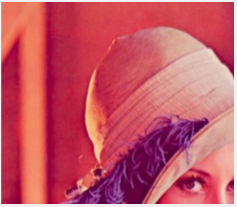

Four-level pyramid image and original image.

**5. Image Translation**

The example first loads the waterdrop.png image, then uses Dip.Translate and Dip.TranslateEx to translate the image: the former fills the blank area after translation with the default color, and the latter with a specified color, and finally displays the original image and the two translation results side by side.

csharp

string strFile = "..\\samples\\waterdrop.png";

KImage img = new KImage();

bool b = img.Load(strFile);

Pool.Assert(b);

KImage imTrans = img.Clone();

Dip.Translate(imTrans.Handle, float.Parse(txbOffsetX.Text), float.Parse(txbOffsetY.Text), false);

KImage imTrans1 = img.Clone();

Dip.TranslateEx(imTrans1.Handle, float.Parse(txbOffsetX.Text), float.Parse(txbOffsetY.Text), false, Pool.RGB(255, 0, 0));

**Background Description**

Image translation belongs to geometric transformation; it moves all pixels in the image by a displacement of dx horizontally and dy vertically. The pixel values themselves do not change, only their positions shift. After translation, part of the image content moves out of the boundary, and a blank area with no pixel coverage appears on the other side, which needs to be filled with a specified color. Unlike rotation and scaling, translation does not involve coordinate scaling or rotation, so no interpolation is required; the operation is fast and the result is lossless. Translation is commonly used in image alignment, registration fine-tuning, ROI position correction, and debugging annotation.

**Function Description**

Dip.Translate(handle, dx, dy, bInvert): Image translation. dx is the horizontal displacement; positive values move right, negative values move left. dy is the vertical displacement; positive values move down, negative values move up. The two displacements are input from the text boxes txbOffsetX and txbOffsetY, of type float, supporting decimal displacements (in which case interpolation is required). The fourth parameter bInvert is false in the example, indicating translation in the conventional direction; if true, it may indicate reverse translation or negation of displacement, depending on the library implementation. After translation, the blank area is filled with the default color (usually black).

Dip.TranslateEx(handle, dx, dy, bInvert, fillColor): Image translation with a fill color. Compared with Translate, it adds a fillColor parameter to specify the fill color for the blank area after translation. In the example, Pool.RGB(255, 0, 0) is passed, i.e., red, so the uncovered area after translation appears red, making the direction and magnitude of translation visually clear. The meanings of the other parameters are the same as Translate.

dx and dy are both of type float; if they are integers, pixels are directly moved; if they contain decimals, interpolation is required, and the result may be slightly blurred.

**Fill Color Comparison**

Translate uses the default fill color (generally black), suitable for scenarios with no special requirements for the blank area; TranslateEx can specify the fill color, suitable for scenarios where the translated region needs to be distinguished from the original content, or where the blank area needs to be unified to a specific color. The fill color does not affect the translation itself, only the display effect and the determination of blank areas in subsequent processing.

**Key Points for Use**

Both translation functions directly modify the data of the passed image, so in the example the original image is cloned first to ensure the two translations do not affect each other, while preserving the original image for comparison display. The choice of displacement should be determined according to task requirements: small displacements for fine-tuning alignment, large displacements for overall position adjustment. After translation, the image size remains unchanged; the part moved out of the boundary is clipped, and the blank part is filled with the fill color. If the complete content before translation needs to be preserved, the image size can be enlarged first and then translated, or it can be composited with other images after translation. After processing, ShowImagesInCanvas(arr, 0) displays the original image and the two results side by side, allowing intuitive comparison of the effect of default fill color and specified fill color on translation. This function is commonly used in image registration, position fine-tuning, ROI correction, and debugging visualization.

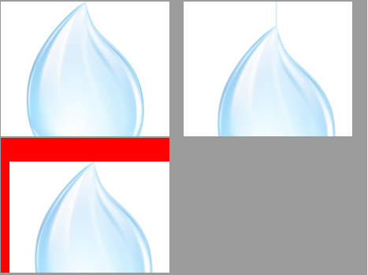

Original image and translated image.

**6. Image Flipping**

The example first loads the waterdrop.png image and converts it to BGR format, then flips the image horizontally, vertically, and in both directions, and finally displays the original image and the three flip results side by side.

csharp

string strFile = "..\\samples\\waterdrop.png";

KImage img = new KImage();

bool b = img.Load(strFile);

Pool.Assert(b);

img.Cast(PixelFormat.BGR);

KImage im1 = img.Clone();

Dip.Flip(im1.Handle, RvDirection.Horizontal);

KImage im2 = img.Clone();

Dip.Flip(im2.Handle, RvDirection.Vertical);

KImage im3 = img.Clone();

Dip.Flip(im3.Handle, RvDirection.Both);

**Background Description**

Image flipping belongs to geometric transformation; it mirrors the image along a specified axis. The pixel values themselves do not change, only their positions shift. Flipping is commonly used in image registration, orientation correction, data augmentation, and symmetry analysis. Unlike rotation, flipping does not involve interpolation; the operation is a one-to-one correspondence pixel by pixel, so it is fast and lossless. After flipping, the image size remains unchanged, and no uncovered blank area appears.

**Function Description**

Dip.Flip(handle, direction) parameters are as follows:

- handle: Handle of the image to be processed.
- direction: Flip direction, specified by the RvDirection enumeration:Horizontal: Flips horizontally along the vertical central axis, i.e., left-right mirroring; image content is swapped left and right.
- Vertical: Flips vertically along the horizontal central axis, i.e., top-bottom mirroring; image content is swapped top and bottom.
- Both: Performs both horizontal and vertical flipping simultaneously, equivalent to rotating 180 degrees; image content is swapped in all directions.

**Difference Between Flipping and Rotation**

Flipping is a mirror transformation that changes the "handedness" of the image (for example, a feature originally on the left is flipped to the right, and its orientation is also reversed left-right); rotation preserves handedness. The result of Both flipping is visually the same as rotating 180 degrees, but rotating 180 degrees may involve interpolation (for arbitrary angles), while Both flipping only swaps coordinates without interpolation. If the image itself is directional (such as text), after flipping the text appears mirrored, while after rotating 180 degrees the text is only upside down.

**Key Points for Use**

Dip.Flip directly modifies the data of the passed image, so in the example the original image is cloned first to ensure the three flips do not affect each other, while preserving the original image for comparison display. Flipping does not change the image size or pixel format, and the processed image can be directly used for subsequent operations. The direction parameter should be selected according to actual needs: horizontal flipping for left-right mirror correction, vertical flipping for top-bottom inversion correction, and bidirectional flipping for scenarios requiring mirroring in both directions simultaneously. After processing, ShowImagesInCanvas(arr, 0) displays the original image and the three results side by side, allowing intuitive verification of whether the flip direction meets expectations. This function is commonly used in image registration, orientation correction, data augmentation, and symmetry analysis.

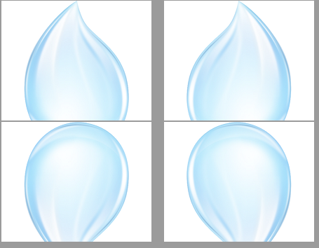

Original image and flipped images.