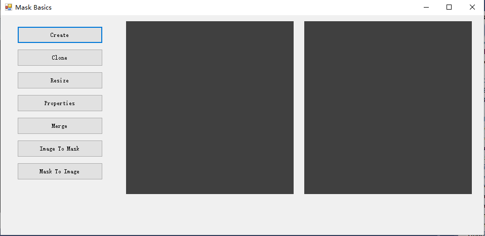

##  Mask Basic Operations

Correspond

A mask is used to identify the regions of elements in an image that participate in analysis and processing. When processing large images, limiting the processing scope via a mask can effectively reduce computation time and improve performance.

Masks are divided into two categories: area masks and linear masks, which differ in data structure and application scenarios. The data of an area mask is a two-dimensional byte array, where each element is either 0 or 1. A value of 1 indicates that the corresponding element participates in processing, and 0 indicates that it does not, defining the region of elements in the image that need to be processed. A linear mask is a sequence of coordinate points of type RvPointF32, representing sampling positions, with adjacent points spaced by 1 element, used to define a specific sampling path or trajectory in the image. Generally, area masks are more widely applicable and more frequently used because they can flexibly define regions of arbitrary shape.

In the current version, only area masks are valid. The linear mask feature is still under development and is not yet available.

## 1. Creating a Mask

Different shapes of masks can be generated via Create and other specific functions. In the example, a KMask object is first instantiated, and Create(MaskShape.FilledEllipse, 160, 160) is called to generate a filled ellipse mask with width and height both 160 elements, i.e., a circle, which is displayed in picPreview1 via ShowMaskInPictureBox. Then CreateBanana(MaskShape.BananaQ1, 160, 4500, 60) is called to generate a banana-shaped (arc) mask, where BananaQ1 represents a quarter-circle arc located in the first quadrant, 160 is the radius (or size), 4500 is the angle parameter in units of 1/100 degree, i.e., 45 degrees, and 60 represents the arc band width. After generation, it is displayed in picPreview2. The mask data is a two-dimensional byte array, where 1 indicates a valid region and 0 indicates an invalid region, which can be used in subsequent image processing to limit the range of elements participating in computation.

Example code:

KMask mask = new KMask();

mask.Create(MaskShape.FilledEllipse, 160, 160);

ShowMaskInPictureBox(mask, picPreview1);

*// Angle unit: 1/100 degree*

mask.CreateBanana(MaskShape.BananaQ1, 160, 4500, 60);

ShowMaskInPictureBox(mask, picPreview2);

## 2. Cloning a Mask

The KMask class is used to create and manipulate masks. In the example, a KMask object is first instantiated with an initial size of 60 $\times$ 60, and then Create(MaskShape.Ring, 100, 80, 20) is called to generate a ring-shaped mask, where 100 is the width, 80 is the height, and 20 is the ring width. Since the long side and short side are not equal (100 $\neq$ 80), what is actually generated is an elliptical ring. After generation, it is displayed in picPreview1 via ShowMaskInPictureBox. Next, the Clone method is called to copy an identical mask newMask, and then Toggle is called to swap the valid and invalid regions of the mask, i.e., elements originally 1 become 0 and those originally 0 become 1, yielding a complementary mask, which is finally displayed in picPreview2. Clone is a deep copy, so the copy and the original mask do not affect each other. Toggle is commonly used to generate an inverse selection region or a background mask.

Example code:

KMask mask = new KMask(60,60);

mask.Create(MaskShape.Ring,100,80,20);

ShowMaskInPictureBox(mask,picPreview1);

KMask newMask = mask.Clone();

newMask.Toggle();

ShowMaskInPictureBox(newMask,picPreview2);

## 3. Changing the Mask Size

The KMask class provides the Resize and Scale methods for adjusting the mask. In the example, a ring-shaped mask is first created (width 100, height 80), and Resize(100, 100, true) is called to adjust the mask size to 100 $\times$ 100. The third parameter true indicates scaling the original content proportionally to fit the new size. Then Scale(1.2f) is called to enlarge the entire mask by a factor of 1.2, so the mask size becomes 1.2 times the original (i.e., 120 $\times$ 120), and the internal valid region is scaled up proportionally as well. The two displays show the effects before and after adjustment respectively. Resize directly changes the mask size by specifying the target width and height, with the content optionally scaled to fit; Scale changes both the mask size and content via a scaling factor, suitable for scenarios requiring overall proportional enlargement.

Example code:

KMask mask = new KMask();

mask.Create(MaskShape.Ring,100,80);

mask.Resize(100,100,true);

ShowMaskInPictureBox(mask,picPreview1);

mask.Scale(1.2f);

ShowMaskInPictureBox(mask,picPreview2);

## 4. Viewing Basic Mask Properties

The KMask class provides a series of property query methods for obtaining the mask's dimensions, memory layout, and geometric information. In the example, a strap mask (MaskShape.FullStrap) with width 120 and height 100 is first created. After display, the following methods are used to read various properties and output a summary to a message box:

- GetWidth(), GetHeight(): mask width and height (in elements).

- GetPitch(): number of bytes per row (row stride), reflecting the interval between adjacent rows in memory.

- GetSize(): total number of bytes in the mask data buffer.

- GetAncor(): anchor position, typically used to define the reference point of the mask (such as the center or a geometric feature point).

- GetOrigin(): origin position, indicating the offset of the mask coordinate system relative to the image coordinate system.

- GetArea(): area of the mask's valid region, i.e., the total number of elements with value 1.

These properties are commonly used for parameter validation before mask processing, memory allocation calculations, and coordinate alignment during image registration.

Example code:

KMask mask = new KMask();

mask.Create(MaskShape.FullStrap, 120, 100);

ShowMaskInPictureBox(mask, picPreview1);

string str = "Properties used frequently \n\n";

str += "Width: {mask.GetWidth()}\n\n";

str += "Height: {mask.GetHeight()}\n\n";

str += "Pitch: {mask.GetPitch()}\n\n";

str += "Size: {mask.GetSize()}\n\n";

str += "Ancor Pos: {mask.GetAncor().ToString()}\n\n";

str += "Origin: {mask.GetOrigin().ToString()}\n\n";

## 5. Mask Merging

The KMask class supports merging two masks according to specified rules via the static Merge method. In the example, two masks of size 100$\times$80 are first created: m1 is a horizontal strap (HorizontalStrap) and m2 is a vertical strap (VerticalStrap). Then KMask.Merge(m1, m2, (int)KMask.MergeType.AnyOf) is called to merge them. AnyOf represents a union operation, i.e., if any corresponding element in either mask is 1, the resulting mask has 1 at that position, so the merged result appears as a cross shape, displayed in picPreview1. Next, Merge is called again with MergeType.Both, representing an intersection operation, i.e., the result is 1 only when both masks have 1 at the corresponding element, so only the overlapping part of the two is retained, displayed in picPreview2. The Merge method returns a new KMask object and does not modify the original masks. The merge type is specified via the MergeType enumeration, with common values including AnyOf (union) and Both (intersection).

Example code:

KMask m1 = new KMask();

m1.Create(MaskShape.HorizontalStrap, 100, 80);

KMask m2 = new KMask();

m2.Create(MaskShape.VerticalStrap, 100, 80);

KMask m = KMask.Merge(m1, m2, (int)KMask.MergeType.AnyOf);

ShowMaskInPictureBox(m, picPreview1);

m = KMask.Merge(m1, m2, (int)KMask.MergeType.Both);

ShowMaskInPictureBox(m, picPreview2);

## 6. Converting an Image to a Mask

KImage can convert a loaded image to binary format (PixelFormat.Bin), and KMask provides the Reshape method, which can directly map the data of a binary image to a mask. In the example, the triangle.png image is first loaded, and Cast(PixelFormat.Bin) is called to convert it to a binary image. At this point, each pixel occupies 1 byte with a value of 0 or 255 (0 for black, 255 for white). Then a KMask object is created and Reshape(im) is called to map the binary image's pixel data to mask elements (a pixel value of 255 corresponds to a mask element of 1, and a value of 0 corresponds to 0), thereby generating a mask exactly matching the image shape. Finally, the binary image and the generated mask are displayed separately, visually verifying their consistency. This process is commonly used to extract a specific shape region from an image as a template for subsequent processing.

Example code:

KImage im = new KImage();

bool ret = im.Load("..\\samples\\triangle.png");

Pool.Assert(ret);

im.Cast(PixelFormat.Bin);

ShowImageInPictureBox(im, picPreview1);

KMask m = new KMask();

m.Reshape(im);

ShowMaskInPictureBox(m, picPreview2);

## 7. Deriving an Image from a Mask

The Derive method of KMask is used to export a mask as a binary image. In the example, a horizontal strap mask with width 100 and height 80 is first created and displayed in picPreview1, then m.Derive() is called to generate the corresponding KImage object. The image has a pixel format of Bin, the same size as the mask, where mask elements with value 1 are mapped to 255 (white) and elements with value 0 are mapped to 0 (black). Finally, the exported binary image is displayed in picPreview2, visually showing the mask shape. This method is commonly used to visualize mask results or pass them to interfaces that only accept image input.

Example code:

KMask m = new KMask();

m.Create(MaskShape.HorizontalStrap, 100, 80);

ShowMaskInPictureBox(m, picPreview1);

KImage im = m.Derive();

ShowImageInPictureBox(im, picPreview2);

